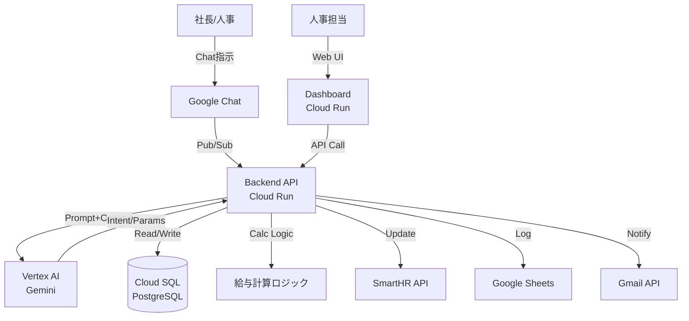

# ADR-001: 全体アーキテクチャ — GCPベース構成

| 項目 | 内容 |
|------|------|
| 日付 | 2026-02-18 |
| ステータス | 承認済み |
| 決定者 | アーキテクチャチーム |

---

## コンテキスト (Context)

HR-AI Agent は、Google Chat 上での社長指示を起点に、AI がドラフトを作成し、人間が承認した後に全ステークホルダーへ通知・データ更新を行うシステムである。

業務基盤として Google Workspace（Google Chat, Google Spreadsheet, Gmail）をすでに利用しており、これらとのシームレスな統合が最優先課題となる。クラウド基盤の選定にあたっては、以下の制約と要件を考慮した。

- GCP プロジェクト: `hr-system-487809`（リージョン: `asia-northeast1`）
- Google Workspace との認証統合（Service Account / OAuth2）
- 従業員の個人情報（PII）を扱うため、データ主権と通信経路の安全性が必須
- スモールスタートかつ拡張性のある構成が求められる

---

## 決定 (Decision)

GCP をクラウド基盤として採用し、**Cloud Run を中心としたサーバーレスコンテナ構成**を採用する。

### 主要コンポーネント構成

| コンポーネント | 採用技術 | 役割 |
|--------------|---------|------|
| Backend API | Cloud Run | ビジネスロジック、AI 呼び出し、DB 操作 |
| Web Dashboard | Cloud Run (Next.js SSR) | 人事担当者向け管理 UI |
| Chat Webhook 受信 | Cloud Run + Pub/Sub | Google Chat からの非同期メッセージ処理 |
| データベース | Cloud SQL (PostgreSQL) | 従業員・給与・ドラフトデータの永続化 |
| AI 推論 | Vertex AI (Gemini) | 自然言語理解・Intent 抽出 |
| 監視・ログ | Cloud Monitoring / Cloud Logging | 運用可視化、監査ログ |
| 認証 | Cloud IAM / Secret Manager | サービス間認証、シークレット管理 |
| CI/CD | Cloud Build / Artifact Registry | コンテナビルドとデプロイ |

### アーキテクチャ図

---

## 理由 (Rationale)

### Google エコシステムとの親和性

- Google Chat API、Gmail API、Google Sheets API はすべて GCP の Service Account で統一的に認証できる
- Vertex AI は GCP ネイティブのため、VPC 内からプライベートエンドポイントでアクセス可能（PII のネットワーク外流出を防止）
- Cloud IAM によって最小権限の原則を一元管理できる

### Cloud Run の採用理由

- サーバーレスコンテナで、ゼロスケール〜オートスケールに対応。スモールスタートで運用コストを最小化できる
- Cloud Functions と比較してコンテナの柔軟性が高く、依存関係や実行時間制限の制約が少ない
- Docker コンテナとして動作するため、ローカル開発との環境差異が最小
- Pub/Sub との Push サブスクリプション連携で非同期処理が容易に実現できる

### Pub/Sub の採用理由

- Google Chat からの Webhook は即時 ACK が必要（200ms 以内）
- AI 推論（Vertex AI 呼び出し）は数秒〜数十秒かかる場合がある
- Pub/Sub を挟むことで、受信と処理を非同期に分離し、UX とシステム信頼性を両立する

---

## 代替案 (Alternatives Considered)

### AWS (Lambda + RDS)

- Google Workspace との統合に追加の認証設定が必要
- リージョンが異なるとレイテンシが発生する可能性がある
- GCP に比べて Google API との親和性が低い
- **不採用理由**: Google エコシステムとの統合コストが高い

### Firebase (Firestore)

- リアルタイム同期など Firebase の強みがこのユースケースに不要
- Firestore は NoSQL であり、給与・従業員データのリレーショナル構造に不向き
- Firebase Auth は Google Workspace の組織アカウント管理と統合しにくい
- **不採用理由**: リレーショナルデータへの不適合

### フルサーバーレス (Cloud Functions)

- 実行時間上限（第2世代で60分）が AI 処理には制約になる可能性がある
- コンテナベースでないため依存関係管理が煩雑
- **不採用理由**: 柔軟性の低さ。Cloud Run がほぼ同コストで上位互換

### AlloyDB / Cloud Spanner

- AlloyDB: 高性能だがコストが高く、現時点のスケールには過剰
- Spanner: グローバル分散が不要なユースケース。コストが高い
- **不採用理由**: コストパフォーマンスに見合わない

---

## 影響 (Consequences)

### ポジティブ

- Google Workspace との統合がシンプルかつセキュアに実現できる
- サーバーレスにより、初期の運用負荷と固定コストを最小化できる
- Pub/Sub による非同期アーキテクチャで、将来的な機能拡張（通知、バッチ処理）が追加しやすい
- GCP 統一により、監査ログ・アクセス制御・シークレット管理が一元化できる

### ネガティブ / リスク

- Cloud SQL の接続プーリング（Cloud SQL Auth Proxy または接続プール設定）を適切に設定しないと、Cloud Run のスケールアウト時に接続数枯渇が発生する
- Pub/Sub のメッセージ順序保証は「ordering key 使用時のみ」のため、順序が重要な処理には設計が必要
- Cloud Run のコールドスタートが初回リクエストのレイテンシに影響する可能性がある（min-instances 設定で緩和可能）
- GCP への強いベンダーロックインが生じる

### 対応策

- Cloud SQL: `pgbouncer` または Cloud SQL Proxy の接続プーリングを設定
- Pub/Sub: ordering key によるメッセージ順序保証を実装
- Cloud Run: `min-instances=1` でコールドスタートを回避（コスト増のトレードオフ）

---

## 関連 ADR

- [ADR-002: LLM選定 — Vertex AI (Gemini)](./ADR-002-llm-selection.md)
- [ADR-003: データベース選定 — Cloud SQL (PostgreSQL)](./ADR-003-database-selection.md)
- [ADR-004: チャット連携方式 — Google Chat API + Pub/Sub](./ADR-004-chat-integration.md)
- [ADR-005: フロントエンド技術 — Next.js (React)](./ADR-005-frontend-technology.md)
- [ADR-006: Human-in-the-loop 設計パターン](./ADR-006-human-in-the-loop.md)
- [ADR-007: AI役割分離 — LLMはパラメータ抽出、計算は確定コード](./ADR-007-ai-role-separation.md)
