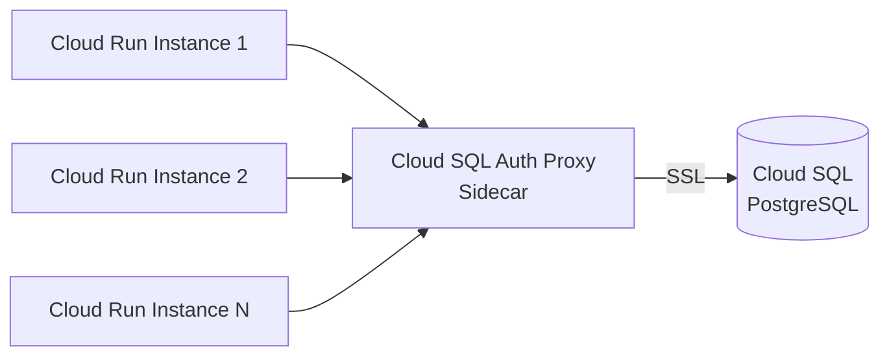
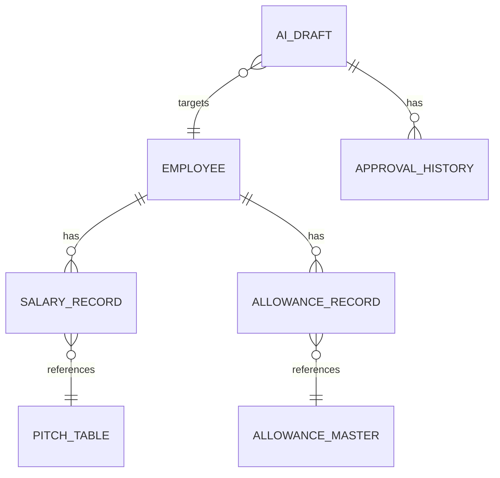

# ADR-003: データベース選定 — Cloud SQL (PostgreSQL)

| 項目 | 内容 |
|------|------|
| 日付 | 2026-02-18 |
| ステータス | 承認済み |
| 決定者 | アーキテクチャチーム |

---

## コンテキスト (Context)

HR-AI Agent は以下のデータを永続化・管理する必要がある。

| データ種別 | 特性 |
|-----------|------|
| 従業員マスタ | 構造化・リレーショナル（社員ID、氏名、部署、雇用形態）|
| 給与データ | 構造化・金額の正確性が必須・履歴管理が必要 |
| 手当マスタ（地域・資格・役職） | 参照テーブル。変更頻度低 |
| Pitch テーブル | 参照テーブル。給与計算の根拠 |
| AI ドラフトデータ | 半構造化（AI の出力 JSON + メタデータ）|
| 承認ワークフローデータ | ステータス遷移・承認者・タイムスタンプ |
| 監査ログ | 誰が何をいつ操作したかの完全な記録 |

### 重要な制約

- 給与データは 1円の誤差も許されない → **ACID トランザクション必須**
- 個人情報保護法・労働基準法への準拠 → **完全な監査ログが必要**
- マスタデータの変更には履歴管理が必要（「いつの時点での計算根拠か」を追跡可能にする）
- Cloud Run（サーバーレス）からの接続 → **接続プーリングへの対応が必要**

---

## 決定 (Decision)

**Cloud SQL for PostgreSQL** をメインデータストアとして採用する。

### 構成詳細

| 項目 | 設定 |
|------|------|
| インスタンスタイプ | Cloud SQL (PostgreSQL 16) |
| リージョン | asia-northeast1 |
| 可用性 | High Availability（プライマリ + スタンバイ）|
| 接続方式 | Cloud SQL Auth Proxy（プライベート IP）|
| バックアップ | 自動バックアップ（7日間保持）+ Point-in-Time Recovery |
| 暗号化 | 保存時暗号化（Cloud KMS）、転送時 TLS |

### 接続プーリング

Cloud Run のスケールアウト時の接続数枯渇を防ぐため、以下の方式を採用する。



接続プールライブラリ（`pgbouncer` または アプリレベルの接続プール）を使用し、最大接続数を制御する。

---

## 理由 (Rationale)

### リレーショナルデータへの適合性

給与・従業員・手当データは強いリレーションを持つ。



- JOIN による複雑なクエリ（「対象従業員の現在の給与と適用手当をすべて取得」）が自然に書ける
- 外部キー制約によるデータ整合性の保証
- トランザクション内での複数テーブル更新（給与変更 + 履歴追記 + 監査ログ）が安全に実行できる

### ACID トランザクション

```sql
BEGIN;
  -- 現在の給与を履歴に移動
  INSERT INTO salary_history SELECT * FROM salary_current WHERE employee_id = $1;
  -- 新しい給与を適用
  UPDATE salary_current SET base_salary = $2, updated_at = NOW() WHERE employee_id = $1;
  -- 監査ログを記録
  INSERT INTO audit_log (action, actor, target_employee_id, before_value, after_value, approved_by)
    VALUES ('salary_change', $3, $1, $4, $5, $6);
COMMIT;
```

このような複数テーブルにまたがるアトミックな更新が、ACID 保証のもとで安全に実行できる。

### JSON/JSONB 型によるハイブリッド対応

AI の出力（Intent 分類結果、パラメータ抽出結果）は半構造化データである。PostgreSQL の JSONB 型を使用することで、同一 DB 内で構造化データと半構造化データを統一的に管理できる。

```sql
CREATE TABLE ai_drafts (
    id UUID PRIMARY KEY DEFAULT gen_random_uuid(),
    status VARCHAR(30) NOT NULL,
    intent VARCHAR(50) NOT NULL,
    extracted_params JSONB NOT NULL,   -- AI 抽出パラメータ
    calculated_result JSONB,           -- 確定計算結果
    llm_raw_response JSONB,            -- デバッグ用生レスポンス
    created_at TIMESTAMPTZ DEFAULT NOW(),
    updated_at TIMESTAMPTZ DEFAULT NOW()
);
```

### Cloud Run との接続容易性

- Cloud SQL Auth Proxy がサイドカーコンテナとして動作し、安全な接続を提供
- Unix ドメインソケットまたは TCP で接続でき、アプリケーションコードへの変更が最小

### マネージドサービスの運用メリット

- 自動バックアップ・Point-in-Time Recovery が組み込まれており、データ損失リスクが低い
- パッチ適用・マイナーバージョンアップグレードは GCP が管理
- Cloud Monitoring との統合で、接続数・クエリ性能・ストレージ使用量を自動監視できる

---

## 代替案 (Alternatives Considered)

### Firestore（NoSQL）

- リアルタイム同期やモバイル向けアプリには有効
- 従業員・給与データのような強いリレーショナル構造には不向き
- JOIN が使えないため、複雑な集計クエリに多数の読み取り操作が必要になる
- ACID トランザクションの制約（同一ドキュメントグループ内のみ）
- **不採用理由**: データ構造の適合性の低さ、トランザクション制限

### AlloyDB for PostgreSQL

- PostgreSQL 互換で Cloud SQL より高性能（OLAP + OLTP 混在に対応）
- 現時点のスループット要件（数十件/日の人事処理）には過剰スペック
- Cloud SQL より価格が高い
- **不採用理由**: 現時点ではコストパフォーマンスに見合わない。将来的な移行オプションとして保留

### Cloud Spanner

- グローバル分散・強整合性トランザクション
- 国内のみの運用でグローバル分散は不要
- 最低課金が高く、スモールスタートに不向き
- **不採用理由**: ユースケースに対してオーバースペックかつ高コスト

### BigQuery

- 大規模分析 DWH として優れるが、OLTP には不適
- INSERT/UPDATE の頻繁な発生するユースケースに非効率
- **不採用理由**: OLTP 用途には不適。将来の分析用途には Cloud SQL から BigQuery へのエクスポートを検討

---

## 影響 (Consequences)

### ポジティブ

- ACID トランザクションにより、給与データの整合性を強く保証できる
- JSONB 型により、AI 出力の非構造化データも同一 DB で管理でき、アーキテクチャがシンプルになる
- マネージドサービスにより、バックアップ・パッチ管理の運用負荷が低い
- PostgreSQL のエコシステム（マイグレーションツール、ORM）が豊富

### ネガティブ / リスク

- **マイグレーション管理**: スキーマ変更はマイグレーションスクリプトで管理する必要がある
  - 対策: `golang-migrate` または `Flyway` を採用し、CI/CD でマイグレーションを自動実行
- **接続数管理**: Cloud Run のスケールアウト時に接続数が急増する可能性がある
  - 対策: アプリレベルの接続プール設定（最大接続数を制限）と、インスタンスの max_connections 設定の調整
- **コールドスタート**: Cloud SQL インスタンスの起動に数分かかる可能性がある
  - 対策: 常時起動（High Availability 設定）で運用

### 運用上の決定事項

| 項目 | 方針 |
|------|------|
| マイグレーション | `golang-migrate` を使用。バージョン管理に含める |
| 接続プール | アプリケーション側で最大接続数を設定（例: max_pool_size=5 / instance）|
| バックアップ | 自動バックアップ（深夜）+ 本番変更前の手動スナップショット |
| 監査ログ | `audit_log` テーブルに全変更を記録。削除は禁止（論理削除のみ）|
| 暗号化 | CMEK（Customer-Managed Encryption Keys）を検討（フェーズ2）|

---

## 関連 ADR

- [ADR-001: 全体アーキテクチャ — GCPベース構成](./ADR-001-gcp-architecture.md)
- [ADR-006: Human-in-the-loop 設計パターン](./ADR-006-human-in-the-loop.md)
- [ADR-007: AI役割分離 — LLMはパラメータ抽出、計算は確定コード](./ADR-007-ai-role-separation.md)
