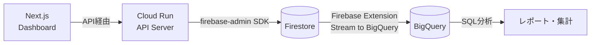

# ADR-003: データベース選定 — Firestore + BigQuery ハイブリッド

| 項目 | 内容 |
|------|------|
| 日付 | 2026-02-18 |
| ステータス | 承認済み（改訂: Cloud SQL → Firestore + BigQuery） |
| 決定者 | アーキテクチャチーム |

---

## コンテキスト (Context)

HR-AI Agent は以下のデータを永続化・管理する必要がある。

| データ種別 | 特性 |
|-----------|------|
| 従業員マスタ | 構造化（社員ID、氏名、部署、雇用形態）|
| 給与データ | 金額の正確性が必須・履歴管理が必要 |
| 手当マスタ（地域・資格・役職） | 参照データ。変更頻度低 |
| Pitch テーブル | 参照データ。給与計算の根拠 |
| AI ドラフトデータ | 半構造化（AI の出力 JSON + メタデータ）|
| 承認ワークフローデータ | ステータス遷移・承認者・タイムスタンプ |
| 監査ログ | 誰が何をいつ操作したかの完全な記録 |

### 重要な制約

- 給与データは 1円の誤差も許されない → **数値計算は整数（円単位）で確定的コード実行**
- 個人情報保護法・労働基準法への準拠 → **完全な監査ログが必要**
- Cloud Run（サーバーレス）からの接続 → **コネクション管理不要が望ましい**
- 小規模組織（50〜200名）→ **コストパフォーマンス重視**
- 月間操作量: 給与変更ドラフト数十件、チャットメッセージ数百件程度

---

## 決定 (Decision)

**Firestore（Native モード）** をメインデータストアとし、分析用途に **BigQuery** を連携するハイブリッド構成を採用する。

### 構成詳細

| 項目 | 設定 |
|------|------|
| メインDB | Firestore (Native mode) |
| リージョン | asia-northeast1 |
| 分析DWH | BigQuery（Firebase Extension でストリーミング連携） |
| 接続方式 | firebase-admin SDK（ADC: Application Default Credentials）|
| バックアップ | Firestore 自動バックアップ（マネージド）|
| 暗号化 | Google 管理キーによる保存時暗号化、転送時 TLS |

### アーキテクチャ



### コレクション設計

全エンティティをルートコレクションとして配置（BigQuery Export との互換性のため）。

```
employees/{docId}          — 従業員マスタ
salaries/{docId}           — 現行給与（employeeId参照）
salary_drafts/{docId}      — AI生成ドラフト
chat_messages/{docId}      — チャットメッセージ + 分類結果
approval_logs/{docId}      — 承認ワークフロー履歴
pitch_tables/{docId}       — Pitchテーブル（マスタ）
allowance_masters/{docId}  — 手当マスタ
```

---

## 理由 (Rationale)

### コストパフォーマンス

本システムの規模（50〜200名、月数十件の変更）では、Firestore が圧倒的に有利。

| 項目 | Firestore + BigQuery | Cloud SQL (PostgreSQL) |
|------|---------------------|------------------------|
| MVP期間 月額 | **$0**（無料枠内） | $7〜15/月（最小インスタンス） |
| 本番運用 月額 | **$0〜2/月** | $15〜30/月 |
| HA構成 | 自動（追加費用なし） | vCPU追加課金 |

Firestore 無料枠: 1GB ストレージ、50K reads/月、20K writes/月、20K deletes/月

### 運用負荷の最小化

- **コネクション管理不要**: Cloud Run のスケールアウト時も接続プーリングの心配なし
- **パッチ適用不要**: フルマネージド、自動スケール
- **バックアップ自動**: Point-in-Time Recovery 組み込み
- **HA自動**: マルチリージョンレプリケーション（追加設定不要）

### データモデルとの適合性

- **SalaryDraft**: Before/After スナップショット（JSON）を自然に格納 → ドキュメント指向と相性が良い
- **ChatMessage**: AI解析結果（JSON）を含む半構造化データ → Firestore 向き
- **ApprovalLog**: 時系列のイベントログ → ドキュメント追記と相性が良い
- **マスタデータ**: 読み取り中心、変更頻度低 → Firestore のキャッシュが効く

### 金額計算の正確性

給与計算の正確性は DB のトランザクション特性ではなく、**アプリケーションコードの確定的計算**（ADR-007）で保証する。

- 全金額は **整数（円単位）** で処理、浮動小数点は使用しない
- Firestore トランザクション内で読み取り→計算→書き込みを実行可能
- バッチ書き込みで複数ドキュメントのアトミック更新が可能（最大500ドキュメント）

### 分析・集計への対応

Firestore 単体では複雑な集計クエリに制限があるが、**BigQuery 連携**で補完する。

- Firebase Extension「Stream Firestore to BigQuery」でリアルタイムエクスポート
- BigQuery 上で SQL による自由な分析・集計が可能
- BigQuery 無料枠: 1TB/月のクエリ処理（本システムには十分）

---

## 代替案 (Alternatives Considered)

### Cloud SQL for PostgreSQL

- ACID トランザクション、SQL の全機能が使える
- **不採用理由**:
  - 本システムの規模に対して常時課金（最小 $7〜15/月）がコスト過剰
  - Cloud Run からの接続プーリング管理が必要（Cloud SQL Auth Proxy + pgbouncer）
  - パッチ適用・バックアップの運用管理が発生
  - 複雑な JOIN は BigQuery で代替可能

### AlloyDB for PostgreSQL

- PostgreSQL 互換で高性能
- **不採用理由**: 規模に対して大幅なオーバースペック、Cloud SQL より高コスト

### Cloud Spanner

- グローバル分散・強整合性
- **不採用理由**: 国内のみの運用で不要、最低課金が非常に高い

---

## 影響 (Consequences)

### ポジティブ

- MVP 期間の DB コストが **実質ゼロ**
- Cloud Run との接続が単純（SDK のみ、Proxy 不要）
- 運用負荷が最小（パッチ・バックアップ・HA すべて自動）
- BigQuery 連携で分析ニーズにも対応可能
- ローカル開発が軽量（Firebase Emulator、Docker 不要）

### ネガティブ / リスク

- **複雑なクエリ制限**: 複合クエリには複合インデックスの事前定義が必要
  - 対策: 必要なクエリパターンを設計時に洗い出し、インデックスを定義
- **JOIN 不可**: コレクション間の結合は アプリケーション層で実装
  - 対策: 必要に応じてデータの非正規化、集計は BigQuery で実行
- **トランザクション制約**: 同一トランザクション内の操作は最大 500 ドキュメント
  - 対策: 本システムの操作規模では十分（一括変更は最大でも数十件）
- **スキーマレス**: 型安全性はアプリケーション層で担保する必要がある
  - 対策: TypeScript の型定義 + Firestore Data Converter で型安全なアクセスを実現

### 運用上の決定事項

| 項目 | 方針 |
|------|------|
| コレクション設計 | ルートコレクション（BigQuery Export 互換） |
| ID 生成 | Firestore 自動生成 ID |
| 監査ログ | `approval_logs` コレクションに全変更を記録。削除禁止 |
| BigQuery 連携 | Firebase Extension でストリーミング（Phase 2 以降） |
| ローカル開発 | Firebase Emulator Suite |
| インデックス | `firestore.indexes.json` でバージョン管理 |

---

## 関連 ADR

- [ADR-001: 全体アーキテクチャ — GCPベース構成](./ADR-001-gcp-architecture.md)
- [ADR-006: Human-in-the-loop 設計パターン](./ADR-006-human-in-the-loop.md)
- [ADR-007: AI役割分離 — LLMはパラメータ抽出、計算は確定コード](./ADR-007-ai-role-separation.md)
