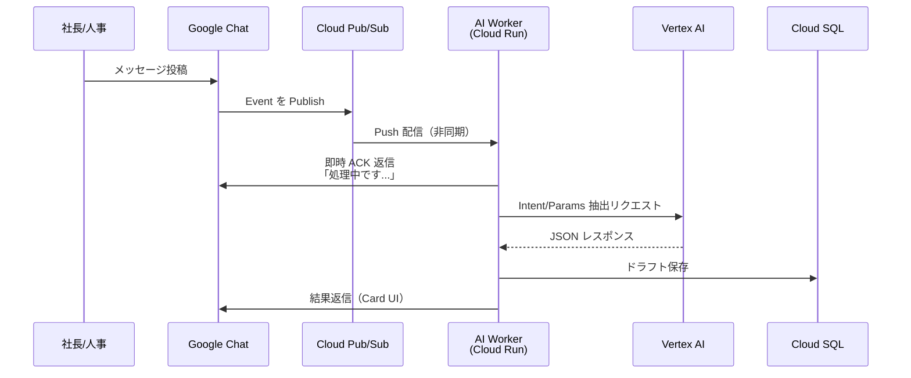
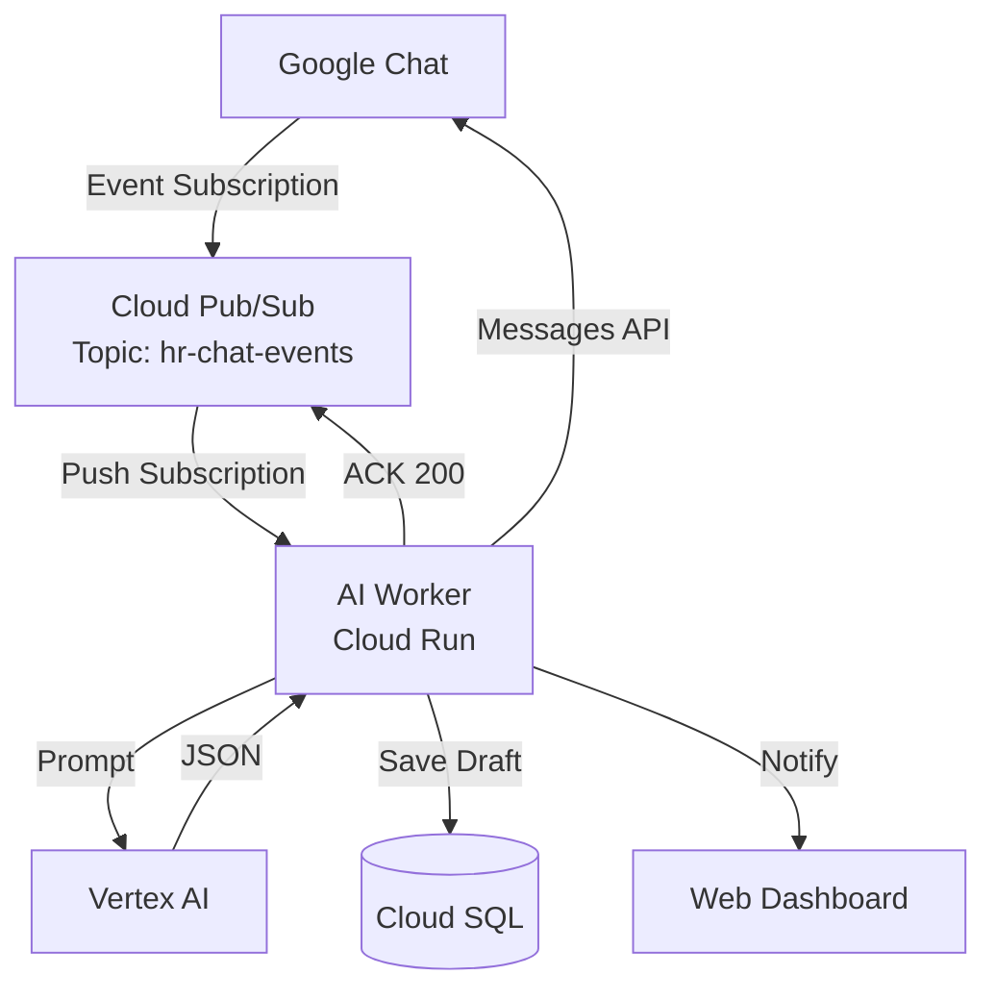
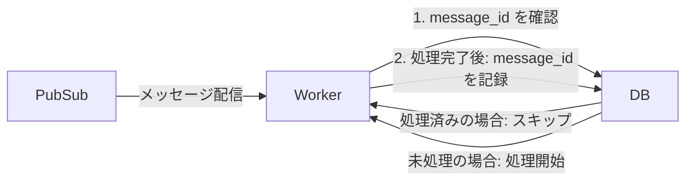

# ADR-004: チャット連携方式 — Google Chat API + Pub/Sub

| 項目 | 内容 |
|------|------|
| 日付 | 2026-02-18 |
| ステータス | 承認済み |
| 決定者 | アーキテクチャチーム |

---

## コンテキスト (Context)

HR-AI Agent の入力は Google Chat 上のメッセージである。社長や人事担当者が特定のスペースにメッセージを投稿すると、システムがそれを受信し、AI 処理を開始する。

### 対象スペースの情報

| スペース | 用途 |
|---------|------|
| 人事関連（全社共通）| 社長・人事担当からの全社的な人事指示 |
| 有川チーム（PJT）| プロジェクト内の人事関連指示 |

- スペース ID: `AAAA-qf5jX0`（サービスアカウントが参加済み）

### 技術的制約

- Google Chat の Webhook への応答は **3秒以内**に返さなければ、タイムアウトエラーとなる
- AI 処理（Vertex AI 呼び出し）は **3秒〜30秒**かかる場合がある
- この非同期性の問題を解決するアーキテクチャが必要

### 要件

- チャットへの即時フィードバック（「処理を開始しました...」）
- AI 処理完了後にチャットへ結果を返信
- メッセージの処理漏れ・重複処理を防ぐ
- 処理失敗時のリトライ機能

---

## 決定 (Decision)

**Google Chat API（Event Subscription + Pub/Sub）による非同期処理アーキテクチャ**を採用する。

### 処理フロー



### アーキテクチャ詳細



### Google Chat Event Subscription 設定

Google Chat の Event Subscription 機能を使用して、特定スペースのメッセージを Pub/Sub トピックに自動配信する。

```yaml
# Event Subscription 設定
event_types:
  - google.workspace.chat.message.v1.created
space_name: "spaces/AAAA-qf5jX0"
notification_endpoint:
  pubsub_topic: "projects/hr-system-487809/topics/hr-chat-events"
```

### Pub/Sub 設定

| 設定項目 | 値 | 理由 |
|---------|-----|------|
| 配信方式 | Push Subscription | Cloud Run への HTTP 直接配信 |
| Acknowledge 期限 | 30秒 | AI 処理の最大想定時間 |
| 最大再配信回数 | 5回 | 一時的な障害への対応 |
| Dead Letter Topic | `hr-chat-events-dlq` | 処理失敗メッセージの保全 |
| メッセージ保持期間 | 7日 | 障害後のリカバリ対応 |

---

## 理由 (Rationale)

### 非同期分離による即時 ACK の実現

Google Chat の Webhook / Event Subscription は応答タイムアウトが短い。AI 処理を同期的に実行すると確実にタイムアウトが発生する。

Pub/Sub を挟むことで：

1. Cloud Run が Event を受信したら**即座に「処理中です...」をチャットに返信**し、Pub/Sub に ACK を返す
2. AI 処理（数秒〜数十秒）をバックグラウンドで実行
3. 完了後にチャットへ結果を送信

この分離により、ユーザー体験（即時フィードバック）とシステム信頼性（重い処理の非同期実行）を両立できる。

### 再試行・耐障害性

Pub/Sub の組み込み再試行機能により、一時的な障害（Vertex AI のタイムアウト、DB 接続エラー）が発生した場合も自動的にリトライされる。Dead Letter Queue により、最終的に失敗したメッセージも失われずに保全される。

### メッセージ重複処理の防止



`message_id` を DB に記録することで冪等性を保証し、重複処理を防ぐ。

### Google Workspace との統合

Event Subscription は Google Workspace の公式機能であり、Service Account による認証で安全に統合できる。Polling 方式と比較して、リアルタイム性が高くリソース効率も良い。

---

## 代替案 (Alternatives Considered)

### Polling 方式（定期的な API ポーリング）

- Cloud Scheduler で定期的に Chat API をポーリングしてメッセージを取得
- 実装がシンプルだが、リアルタイム性が低い（ポーリング間隔に依存）
- API 呼び出し回数が増え、コストが上がる
- **不採用理由**: リアルタイム性の低さと無駄な API 呼び出し

### Cloud Functions 直接トリガー

- Webhook を Cloud Functions で直接受信して処理
- 実行時間制限（第2世代: 60分）が問題になる可能性は低いが、非同期処理のパターンが複雑になる
- Pub/Sub を使わない場合、再試行ロジックを自前で実装する必要がある
- **不採用理由**: Pub/Sub を活用する方が再試行・DLQ 機能を簡単に得られる

### Cloud Tasks

- タスクキューとして Pub/Sub の代替になり得る
- HTTP ターゲット向けのキューイングに向いているが、Pub/Sub の方が Google Chat Event Subscription との統合が直接的
- **不採用理由**: Pub/Sub が Event Subscription とネイティブ統合されており、追加設定が不要

### Dialogflow CX

- Google の会話 AI プラットフォームとして Chat との統合が可能
- 汎用的な会話フローには向くが、人事処理特有の複雑なパラメータ抽出には柔軟性が低い
- Vertex AI Gemini を直接使う方が、JSON Structured Output などの細かい制御が可能
- **不採用理由**: 人事処理特有の要件への適合性が低い

---

## 影響 (Consequences)

### ポジティブ

- ユーザーが「処理中です...」の即時フィードバックを受け取れ、UX が向上する
- Pub/Sub の再試行・DLQ により、一時的な障害に対する耐性が高まる
- メッセージ処理の冪等性を保証でき、重複処理が防げる
- 将来的に複数ワーカー（給与処理、社保処理など）へのメッセージルーティングが容易

### ネガティブ / リスク

- **複雑性の増加**: 同期処理に比べてシステムの複雑性が増す
  - 対策: ローカル開発環境では Pub/Sub エミュレーターを使用
- **メッセージ遅延の可視性**: Pub/Sub の遅延が発生した場合、ユーザーには見えない
  - 対策: Cloud Monitoring でキューの遅延をアラート監視
- **DLQ の運用**: 処理失敗したメッセージを手動でリカバリする仕組みが必要
  - 対策: DLQ の内容を定期的にアラートし、管理者が確認できる仕組みを実装

### チャット UI/UX 設計

- 受信時: シンプルなテキスト「✓ 受け付けました。処理を開始します...」
- 完了時: Google Chat Card（Card v2）形式でドラフト内容を構造化表示
- エラー時: エラー内容と問い合わせ先を明示

---

## 関連 ADR

- [ADR-001: 全体アーキテクチャ — GCPベース構成](./ADR-001-gcp-architecture.md)
- [ADR-002: LLM選定 — Vertex AI (Gemini)](./ADR-002-llm-selection.md)
- [ADR-006: Human-in-the-loop 設計パターン](./ADR-006-human-in-the-loop.md)
