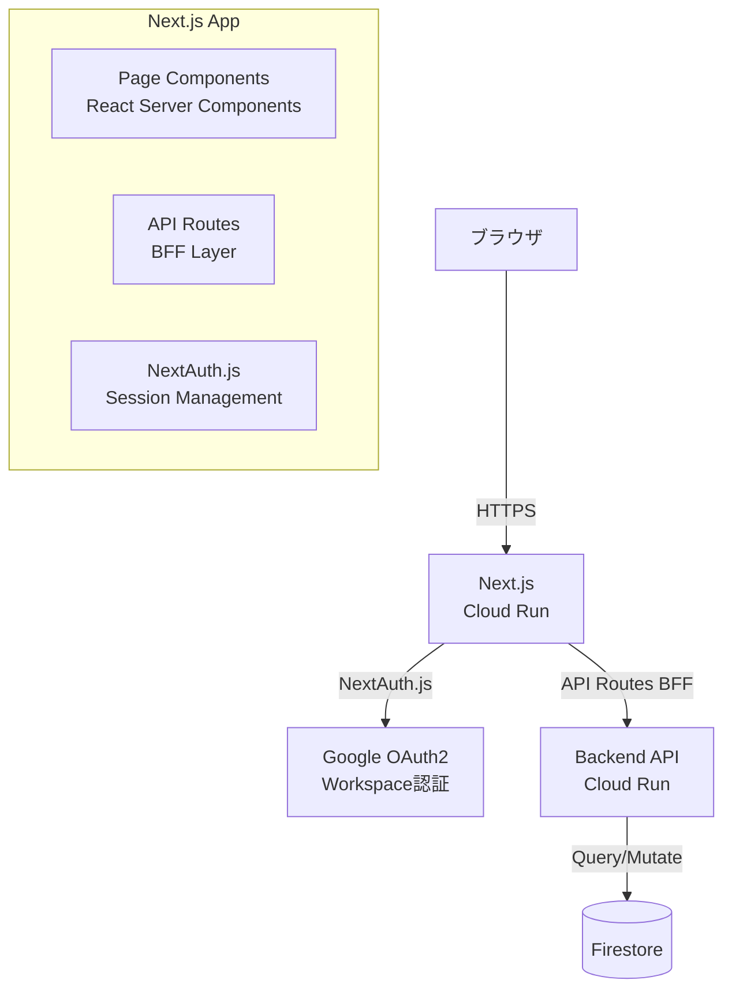
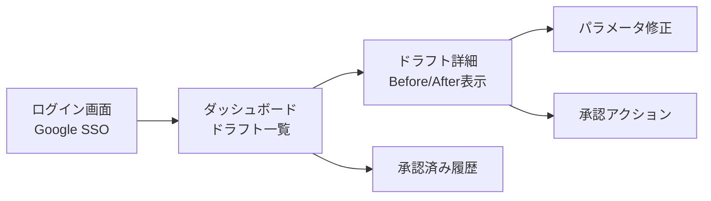

# ADR-005: フロントエンド技術 — Next.js (React)

| 項目 | 内容 |
|------|------|
| 日付 | 2026-02-18 |
| ステータス | 承認済み |
| 決定者 | アーキテクチャチーム |

---

## コンテキスト (Context)

HR-AI Agent では、AI が生成したドラフトを人事担当者が確認・修正・承認するための管理ダッシュボードが必要である。

### ユーザーと主な操作

| ユーザー | 操作 |
|---------|------|
| 人事担当者 | ドラフト一覧確認、内容修正、一次チェック |
| 承認権限者（社長等） | 裁量的変更の最終承認 |

### UI 機能要件

| 機能 | 詳細 |
|------|------|
| ドラフト一覧 | ステータス別フィルタリング（`draft` / `reviewed` / `pending_ceo_approval` / `approved` 等）|
| Before/After 差分表示 | 変更前後の給与・手当の数値をハイライト表示 |
| AI 判断理由メモ | LLM が抽出した Intent・パラメータと信頼度スコアの表示 |
| 承認ワークフロー | 「人事チェック → （必要に応じて）社長承認」の段階的ボタン操作 |
| 修正インターフェース | AI 抽出パラメータの手動修正フォーム |
| 通知履歴 | 承認後の通知・SmartHR 更新の実行ログ |

### 技術的制約

- デプロイ先は Cloud Run（ADR-001 と統一）
- Google アカウント（Google Workspace）による認証が必要
- 社内向けツールのためSEO不要、パフォーマンスと開発効率が優先
- 小規模チームでの開発・保守を想定

---

## 決定 (Decision)

**Next.js (React) を Cloud Run 上で SSR（Server-Side Rendering）モードで動作させる**構成を採用する。

### 技術スタック詳細

| 役割 | 採用技術 | 選定理由 |
|------|---------|---------|
| フレームワーク | Next.js (App Router) | SSR/SSG の柔軟な選択、React エコシステム活用 |
| UI ライブラリ | shadcn/ui + Tailwind CSS | 高品質コンポーネント、カスタマイズ性 |
| 差分表示 | react-diff-viewer または独自実装 | Before/After ハイライト表示 |
| 認証 | NextAuth.js (Google Provider) | Google Workspace 認証の容易な統合 |
| API 通信 | tRPC または REST (fetch) | 型安全な API 通信 |
| 状態管理 | React Server Components + useState | サーバー状態はサーバーで、クライアント状態は最小化 |
| デプロイ | Cloud Run（コンテナ）| ADR-001 との統一 |

### アーキテクチャ図



### BFF（Backend for Frontend）パターン

Next.js の API Routes を BFF レイヤーとして活用し、フロントエンドに必要なデータの集約・整形を担当させる。

```
Browser
  └─▶ Next.js API Routes (BFF)
        ├─▶ Backend API (Cloud Run) - ドラフトデータ取得
        ├─▶ Backend API (Cloud Run) - 承認アクション
        └─▶ Google APIs - ユーザー情報
```

### 主要画面構成



---

## 理由 (Rationale)

### SSR によるパフォーマンスとセキュリティ

- サーバーサイドでデータを取得してレンダリングすることで、初期表示が速い
- 機密性の高い人事データを API から直接ブラウザに渡さず、サーバー側で処理できる
- SEO は不要だが、パフォーマンスの観点で SSR は有利

### React エコシステムの豊富さ

- Before/After 差分表示、フォームバリデーション、データグリッドなど、要件に合致するライブラリが豊富
- shadcn/ui により、高品質な管理画面 UI を短期間で構築できる
- React の開発者人口が多く、採用・保守の観点で有利

### Cloud Run への統合

- Docker コンテナとしてビルドでき、ADR-001 の Cloud Run デプロイ方針と完全に整合する
- Backend API と同じ GCP プロジェクト・VPC 内に配置でき、内部通信が効率的
- Cloud Build による CI/CD パイプラインを Backend API と共通化できる

### Google Workspace 認証との統合

- NextAuth.js の Google Provider を使用することで、Google Workspace アカウントによる SSO を数行のコードで実装できる
- 組織内のドメイン制限（`@example.co.jp` のみ許可）を容易に設定できる

### 開発効率

- TypeScript による型安全な開発
- React Server Components により、サーバー/クライアントの境界を明示的に設計できる
- ローカル開発環境での高速な HMR（Hot Module Replacement）

---

## 代替案 (Alternatives Considered)

### Vue.js / Nuxt.js

- React と同等の SPA/SSR 機能を持つ
- エコシステムは React に比べてやや小さい
- チームの React 習熟度を考慮すると学習コストが発生する
- **不採用理由**: React との差別化優位性が乏しく、移行コストに見合わない

### SvelteKit

- バンドルサイズが小さく、パフォーマンスが高い
- エコシステムが React に比べて成熟途上
- 管理画面向け UI ライブラリが少ない
- **不採用理由**: 管理画面向けエコシステムの成熟度不足

### 管理画面 SaaS（Retool、AppSheet 等）

- 低コードでの管理画面構築が可能
- 承認ワークフロー、Before/After 差分表示など、要件への柔軟な対応が困難
- 外部 SaaS に人事データが送信されるセキュリティリスク
- 月額コストが継続的に発生
- **不採用理由**: セキュリティリスクとカスタマイズ性の制約

### Flask/Django（Python）でのサーバーサイドレンダリング

- Backend API が Python の場合、同言語で統一できる
- 管理画面向けの UI コンポーネントエコシステムが React より貧弱
- インタラクティブな差分表示など、SPA 的なUXの実装が困難
- **不採用理由**: インタラクティブな UI 要件への適合性が低い

---

## 影響 (Consequences)

### ポジティブ

- Google Workspace 認証と統合した安全な管理画面を短期間で構築できる
- 豊富な UI ライブラリにより、Before/After 差分表示などの複雑な UI も実装しやすい
- Cloud Run への統一デプロイにより、インフラ管理が一元化される
- TypeScript による型安全な開発で、実行時エラーを削減できる

### ネガティブ / リスク

- **Node.js ランタイムの追加**: Backend API（Python 等を想定）と別ランタイムになる
  - 対策: それぞれ独立した Cloud Run サービスとしてデプロイ。Dockerfile を分離
- **SSR のコールドスタート**: Cloud Run のコールドスタート時に SSR の初回レンダリングが遅くなる可能性
  - 対策: `min-instances=1` を設定（コスト増のトレードオフを許容）
- **セッション管理**: NextAuth.js のセッションストアをスケールアウト環境で共有する必要がある
  - 対策: JWT セッション（ステートレス）を使用するか、Cloud Memorystore (Redis) でセッション共有

### セキュリティ考慮事項

| 項目 | 対策 |
|------|------|
| 認証 | Google Workspace SSO（組織ドメイン制限）|
| 認可 | ロールベースアクセス制御（人事担当 / 承認者）|
| CSRF 対策 | NextAuth.js の組み込み CSRF トークン |
| XSS 対策 | React の自動エスケープ + CSP ヘッダー設定 |
| 通信 | HTTPS 強制（Cloud Run デフォルト）|

---

## 関連 ADR

- [ADR-001: 全体アーキテクチャ — GCPベース構成](./ADR-001-gcp-architecture.md)
- [ADR-003: データベース選定 — Firestore + BigQuery](./ADR-003-database-selection.md)
- [ADR-006: Human-in-the-loop 設計パターン](./ADR-006-human-in-the-loop.md)
