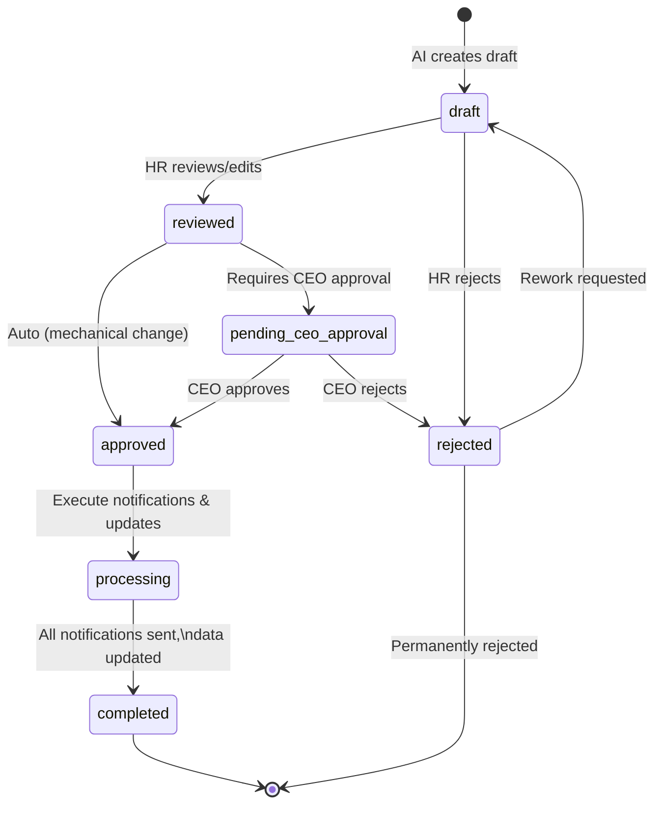
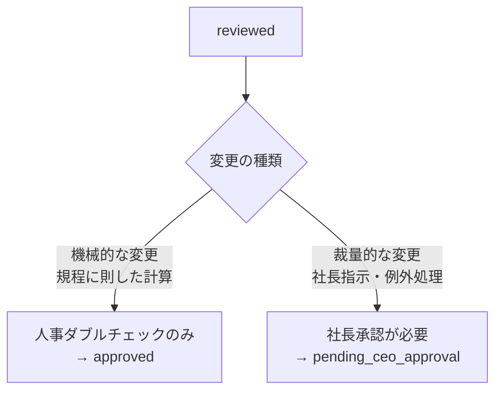

# ADR-006: Human-in-the-loop 設計パターン

| 項目 | 内容 |
|------|------|
| 日付 | 2026-02-18 |
| ステータス | 承認済み |
| 決定者 | アーキテクチャチーム |

---

## コンテキスト (Context)

HR-AI Agent は AI（LLM）が人事処理のドラフトを生成するシステムである。しかし、以下の理由から AI の出力を完全に信頼することはできない。

### AI の限界

- **ハルシネーション**: LLM は自信を持って誤った情報を生成することがある
- **確率的出力**: 同じ入力に対して毎回同じ結果を保証できない
- **コンテキスト理解の限界**: 曖昧な指示や暗黙の前提を誤解する可能性がある
- **計算の不正確性**: LLM は数値計算の正確性を保証できない（ADR-007 参照）

### ビジネスリスク

- 給与変更・退職手続き等の金銭的・法的に重要な処理を扱う
- 1円の誤差、1人の対象漏れも許されない
- 不正確な処理は従業員の信頼失墜・法的リスクに直結する

### 要件

- AI が生成したすべてのドラフトに対して人間の確認を必須とする
- 処理の種類（機械的 vs 裁量的）に応じて承認権限者を変える
- 状態遷移に「行き止まり」（処理が止まったまま進めない状態）がないことを保証する
- 全ステータス変更の監査ログを完全に記録する

---

## 決定 (Decision)

**全 AI ドラフトに対して人間の確認・承認を必須とする段階的承認フロー**を採用する。

### ステータス定義

| ステータス | 意味 | 次のアクション |
|-----------|------|--------------|
| `draft` | AI がドラフト生成完了 | 人事担当者がレビュー |
| `reviewed` | 人事担当者がレビュー・修正完了 | 変更種別に応じて分岐 |
| `pending_ceo_approval` | 社長の承認待ち | 社長が承認 or 却下 |
| `approved` | 最終承認完了 | 通知・データ更新の実行開始 |
| `processing` | 通知・データ更新を実行中 | 自動処理完了まで待機 |
| `completed` | 全処理完了 | 終了 |
| `rejected` | 却下（人事 or 社長による）| 差し戻しまたは終了 |

### ステータス遷移図



### 承認権限の分岐基準



#### 機械的な変更（人事ダブルチェックのみで承認可能）

- Pitch テーブルに基づく定期昇給
- 規程に明記された手当の付与・変更（資格取得、地域異動）
- 入社・退職の標準フロー（計算に裁量が入らないもの）

#### 裁量的な変更（社長承認必須）

- 社長指示による個別の給与変更
- 規程外の特別手当
- 例外的な雇用条件の変更

---

## 理由 (Rationale)

### 完全自動化を採用しない理由

金銭・雇用に関わる処理でのハルシネーションや計算ミスは、即座に実害（給与誤支給、法的問題）につながる。現時点では AI の信頼性は「支援ツール」のレベルであり、「完全自動実行」を委ねる段階ではない。

Human-in-the-loop を設計の中心に置くことで：

1. AI のミスを人間がキャッチできる安全網を確保する
2. 監査証跡（誰が何を確認・承認したか）を法令対応の観点で確保する
3. AI の出力品質を継続的にモニタリングし、改善サイクルを回せる

### 段階的な自動化への対応

現在は Human-in-the-loop を必須とするが、将来的には信頼性が確認されたカテゴリから自動化範囲を段階的に広げることができる設計にする。ステータス遷移の分岐条件を設定値（DB や設定ファイル）で管理することで、コード変更なしに自動化範囲を調整できる。

### 行き止まりなし設計

`rejected` ステータスからは必ず `draft`（差し戻し）または終了のどちらかに遷移できる。処理が止まったまま誰も操作できない状態を設計上排除している。

---

## 代替案 (Alternatives Considered)

### 完全自動化

- 承認なしで AI ドラフトをそのまま実行
- 処理速度は最速だが、エラー発生時のリカバリコストが極めて高い
- 法的・財務的リスクが許容できない水準
- **不採用理由**: リスクが許容できない

### 閾値による自動承認（例: 5ピッチ以下は自動）

- 変更幅が小さければ自動承認、大きければ人間承認
- 「小さい変更」の定義が難しく、積み重なった小さな変更が問題になる可能性がある
- 閾値の恣意性と、閾値を超えた場合のみ確認する体制への慣れが生じるリスク
- **不採用理由**: 安全網の穴になる可能性がある。フェーズ2での検討事項として保留

### 承認なしのドラフト確認のみ

- 人間が確認するが「承認」ボタンがなく、確認後に自動実行
- 確認が形骸化しやすい（クリックするだけになる）
- 承認の責任の所在が不明確になる
- **不採用理由**: 責任の明確化と形骸化防止の観点で不採用

---

## 影響 (Consequences)

### ポジティブ

- AI のミスを人間が発見できる安全網が確保される
- 承認の証跡（誰が、いつ、何を承認したか）が監査ログに記録される
- 将来的な自動化範囲の拡大に対応できる柔軟な設計
- 人事担当者が AI の判断根拠を確認することで、AI リテラシーの向上にもつながる

### ネガティブ / リスク

- **処理速度の低下**: 人間の確認・承認待ちが発生するため、完全自動化より処理に時間がかかる
  - 対策: 通知機能（Google Chat、メール）により人事担当者・社長への確認依頼を即時送信
- **人的ミスのリスク**: 人間も間違える
  - 対策: Before/After 差分表示を明確に UI に提示し、確認漏れを防ぐ
- **承認の形骸化リスク**: 慣れにより確認が雑になる
  - 対策: 重要変更（金額閾値超過等）には追加の確認ステップを設ける

### 監査ログ設計

すべてのステータス変更を以下の形式で記録する。

```sql
CREATE TABLE approval_history (
    id UUID PRIMARY KEY DEFAULT gen_random_uuid(),
    draft_id UUID NOT NULL REFERENCES ai_drafts(id),
    from_status VARCHAR(30) NOT NULL,
    to_status VARCHAR(30) NOT NULL,
    actor_email VARCHAR(255) NOT NULL,
    actor_role VARCHAR(50) NOT NULL,  -- 'hr_staff' | 'hr_manager' | 'ceo'
    comment TEXT,
    created_at TIMESTAMPTZ DEFAULT NOW()
);
```

### 通知設計

| イベント | 通知先 | 通知方法 |
|---------|-------|---------|
| draft 生成完了 | 人事担当者 | Google Chat |
| reviewed 完了（社長承認待ち）| 社長 | Google Chat + Gmail |
| approved 完了 | 対象従業員・関係者 | Gmail |
| rejected | 起票者 | Google Chat |
| processing 完了 | 人事担当者 | Google Chat |

---

## 関連 ADR

- [ADR-001: 全体アーキテクチャ — GCPベース構成](./ADR-001-gcp-architecture.md)
- [ADR-002: LLM選定 — Vertex AI (Gemini)](./ADR-002-llm-selection.md)
- [ADR-003: データベース選定 — Cloud SQL (PostgreSQL)](./ADR-003-database-selection.md)
- [ADR-005: フロントエンド技術 — Next.js (React)](./ADR-005-frontend-technology.md)
- [ADR-007: AI役割分離 — LLMはパラメータ抽出、計算は確定コード](./ADR-007-ai-role-separation.md)
