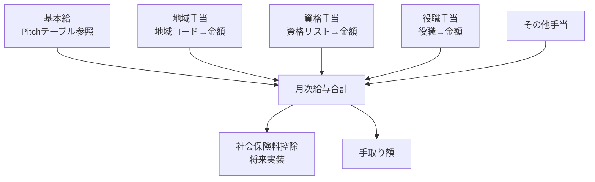
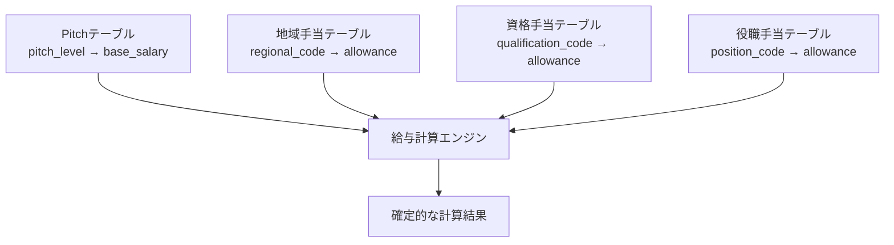

# ADR-007: AI役割分離 — LLMはパラメータ抽出、計算は確定コード

| 項目 | 内容 |
|------|------|
| 日付 | 2026-02-18 |
| ステータス | 承認済み |
| 決定者 | アーキテクチャチーム |

---

## コンテキスト (Context)

HR-AI Agent の中核機能は「自然言語の指示から給与変更等の処理を正確に実行すること」である。この処理には2つの性質が全く異なるタスクが含まれる。

| タスク | 性質 | 適切なアプローチ |
|-------|------|---------------|
| 自然言語の理解 | 曖昧性の解消・文脈理解が必要 | LLM（確率的モデル）|
| 給与・手当の計算 | 1円の誤差も許されない | 確定的プログラムコード |

### 給与計算の複雑さ

給与計算は以下の複数要素の組み合わせで構成される。



### LLM に計算をさせることの危険性

- LLM は「確率的な次トークン予測」を行うモデルであり、計算の正確性を**保証できない**
- GPT-4 等の最高性能モデルでも、複雑な計算で誤りが発生することが知られている
- 「124,500円 + 15,000円 + 8,000円 = 147,500円」という計算も LLM には失敗のリスクがある
- 計算ミスが Human-in-the-loop（ADR-006）をすり抜けた場合、実害が発生する

---

## 決定 (Decision)

**LLM の役割を「自然言語の理解・構造化（パラメータ抽出）」に厳密に限定し、一切の金銭計算は確定的プログラムコードで実行する。**

### 役割分担の全体像

```mermaid
graph LR
    subgraph "LLMの担当領域（確率的）"
        Input[自然言語入力\n「田中さんを2ピッチ上げて」]
        Intent[Intent分類\nsalary_change]
        Params[パラメータ抽出\n{target, delta, date}]
        Clarify[曖昧さの解消\n確認プロンプト生成]
    end

    subgraph "確定コードの担当領域（決定論的）"
        PitchLookup[Pitchテーブル参照\n現在Pitch→新Pitch→金額]
        AllowanceCalc[手当計算\n地域/資格/役職]
        TotalCalc[合計給与算出\n各手当を合算]
        SocialIns[社保計算\n将来実装]
        Diff[Before/After差分生成]
    end

    Input --> Intent
    Intent --> Params
    Params --> PitchLookup
    PitchLookup --> AllowanceCalc
    AllowanceCalc --> TotalCalc
    TotalCalc --> Diff
```

### LLM の担当スコープ

| 機能 | 詳細 |
|------|------|
| Intent 分類 | 10カテゴリへの分類（`salary_change`, `hire`, `resignation` 等）|
| パラメータ抽出 | 対象者・変更内容・時期の JSON 構造化 |
| 曖昧な指示の検出 | 「30万くらいで」→ 確認が必要と判定 |
| 確認プロンプト生成 | 不明なパラメータに対する自然な質問文の生成 |
| エラーメッセージ生成 | ユーザーへのわかりやすいフィードバック |

**LLM は絶対に行わないこと:**
- 金額の計算（足し算・掛け算を含む）
- テーブル参照後の数値の組み合わせ
- 社会保険料の算出

### 確定コードの担当スコープ

| 機能 | 実装方式 |
|------|---------|
| Pitch テーブル参照 | DB クエリ（`SELECT amount FROM pitch_table WHERE pitch_level = $1`）|
| 地域手当計算 | DB クエリ（地域コードから金額を取得）|
| 資格手当計算 | DB クエリ（資格リストから手当を合算）|
| 役職手当計算 | DB クエリ（役職コードから手当を取得）|
| 合計給与算出 | 純粋な算術演算（整数演算、浮動小数点を使わない）|
| Before/After 差分生成 | 旧値と新値の比較・差分オブジェクト生成 |
| 社会保険料計算（将来）| 法定テーブルに基づく確定的計算 |

---

## 理由 (Rationale)

### LLM の確率的性質による計算リスク

LLM は統計的言語モデルであり、その出力は確率的である。数学的に正確な計算を保証する仕組みを持たない。

```
# LLM に計算させた場合の失敗例（実際に発生し得るケース）
入力: 「基本給 247,000円 + 地域手当 15,000円 + 資格手当 8,500円」
期待出力: 270,500円
LLM出力（失敗例）: 271,500円  ← 1,000円の誤差
```

この誤差が Human-in-the-loop の確認をすり抜けると、毎月 1,000円の給与誤支給が発生し続ける。

### 確定的コードの保証性

```python
def calculate_total_salary(employee_id: str, effective_date: date) -> SalaryCalculation:
    """
    確定的な給与計算。同じ入力には必ず同じ結果を返す。
    浮動小数点誤差を避けるため、金額は整数（円）で扱う。
    """
    base_salary = fetch_pitch_amount(employee_id, effective_date)  # DB参照
    regional = fetch_regional_allowance(employee_id, effective_date)  # DB参照
    qualification = sum(fetch_qualification_allowances(employee_id))  # DB参照
    position = fetch_position_allowance(employee_id, effective_date)  # DB参照

    total = base_salary + regional + qualification + position  # 整数演算

    return SalaryCalculation(
        base_salary=base_salary,
        regional_allowance=regional,
        qualification_allowance=qualification,
        position_allowance=position,
        total=total,
        calculation_basis={  # 計算根拠を記録（監査対応）
            "pitch_level": ...,
            "regional_code": ...,
            "qualifications": [...],
            "position_code": ...,
        }
    )
```

### テスト可能性

確定的コードは単体テストで完全に検証できる。

```python
def test_salary_calculation_standard_case():
    """ピッチ10、東京、資格なし、一般職の給与計算"""
    result = calculate_total_salary("EMP-001", date(2026, 3, 1))
    assert result.base_salary == 247_000  # Pitch10の基本給
    assert result.regional_allowance == 15_000  # 東京手当
    assert result.qualification_allowance == 0
    assert result.total == 262_000

def test_salary_calculation_with_qualification():
    """資格手当あり（AWS認定 + 簿記2級）"""
    result = calculate_total_salary("EMP-002", date(2026, 3, 1))
    assert result.qualification_allowance == 20_000  # 10,000 + 10,000
```

LLM の出力は同じテストが毎回成功することを保証できないが、確定コードは可能である。

### 責任の明確化

LLM がパラメータ抽出を担当し、確定コードが計算を担当することで、問題発生時の原因特定が容易になる。

- 「田中さんではなく田中花子さんを処理してしまった」→ LLM のパラメータ抽出ミス
- 「給与の合計額が間違っていた」→ 確定コードのバグ（再現性があり修正可能）

---

## 代替案 (Alternatives Considered)

### LLM に計算もさせてダブルチェック

- LLM で計算させた結果を確定コードで検証し、不一致の場合はエラーとする
- LLM の計算結果が毎回異なる可能性があり、ダブルチェックの基準にならない
- 実装の複雑性が上がるだけで、確定コードのみより信頼性は向上しない
- **不採用理由**: LLM の計算結果は信頼できる基準にならない

### 計算専用の小型 Fine-tuning モデル

- 給与計算に特化した小型モデルを Fine-tuning して使用
- Fine-tuning データの準備・維持コストが高い
- 法定テーブルの変更（社会保険料率改定等）のたびにモデルの再訓練が必要
- それでも確率的モデルであることは変わらない
- **不採用理由**: 確定的な計算の信頼性を保証できない点は同じ

### スプレッドシート（Google Sheets）での計算

- 現在の運用（人手）に近い方式
- 自動化・監査ログ記録・バージョン管理が困難
- **不採用理由**: システム化の目的に反する

---

## 影響 (Consequences)

### ポジティブ

- 給与計算の正確性が 100% 保証される（確定的コードのため）
- テストにより計算ロジックを完全に検証できる
- 計算根拠（どのテーブルの値を使ったか）を記録でき、監査対応が容易
- 法定テーブルの変更（社会保険料率改定等）はコード修正で対応でき、LLM の再訓練が不要

### ネガティブ / リスク

- **マスターデータ管理の必要性**: Pitch テーブル、地域手当テーブル、資格手当テーブルなどのマスターデータを DB で正確に管理する必要がある
  - 対策: マスターデータの管理 UI を構築し、変更履歴を保持する
- **テーブル管理コスト**: 法定テーブル（社会保険料率等）の改定に追随する運用コストが発生する
  - 対策: 厚生労働省等の公式情報源からの定期更新フローを確立する
- **パラメータ抽出ミスの下流影響**: LLM がパラメータを誤って抽出した場合、正確な計算に誤った値が入力される
  - 対策: Human-in-the-loop（ADR-006）で人間が Before/After 差分を確認する必須ステップを設ける

### マスターデータ管理の重要性

この設計の成否は、マスターデータの正確性に依存する。以下のテーブルを適切に管理することが前提条件となる。



---

## 関連 ADR

- [ADR-001: 全体アーキテクチャ — GCPベース構成](./ADR-001-gcp-architecture.md)
- [ADR-002: LLM選定 — Vertex AI (Gemini)](./ADR-002-llm-selection.md)
- [ADR-003: データベース選定 — Cloud SQL (PostgreSQL)](./ADR-003-database-selection.md)
- [ADR-006: Human-in-the-loop 設計パターン](./ADR-006-human-in-the-loop.md)
