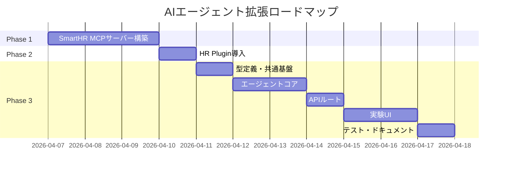
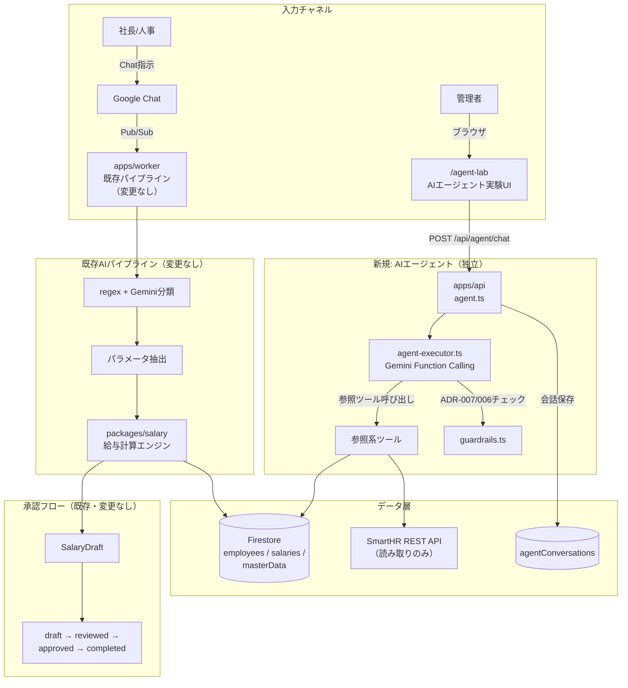
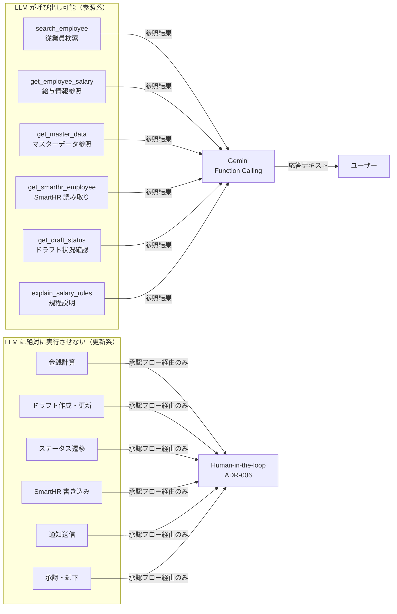

# ADR-008: AIエージェント拡張 — MCP + Function Calling 段階導入

| 項目 | 内容 |
|------|------|
| 日付 | 2026-04-05 |
| ステータス | ドラフト |
| 決定者 | アーキテクチャチーム |

---

## コンテキスト (Context)

現在の HR-AI Agent は「Intent 分類 + パラメータ抽出 → 確定コードで計算 → ドラフト生成」の直線的パイプラインで動作している。この設計は ADR-007（AI 役割分離）に基づき正確性を保証しているが、以下の限界がある。

### 現行パイプラインの限界

| 限界 | 詳細 |
|------|------|
| 単一ターン制約 | ユーザーの曖昧な指示に対して追加質問ができない。1 回の Chat メッセージで全パラメータを確定する必要がある |
| データ参照の硬直性 | パイプライン中で参照できる情報が worker にハードコードされたクエリのみ。文脈に応じた柔軟なデータ取得ができない |
| SmartHR 連携未実装 | `WorkflowSteps` 型に `smartHRReflection` ステップが定義済みだが API は未接続 |
| 開発効率 | SmartHR 上の従業員データ確認が手動ブラウザ操作に依存。Claude Code からの直接参照ができない |

### AIエージェントの進化

2025-2026 年にかけて、AI エージェントの標準技術が成熟してきた。

- **MCP (Model Context Protocol)**: Anthropic が開発し Linux Foundation に寄贈。Claude Code / Cowork から外部データソースへの標準接続プロトコル
- **Function Calling**: Gemini / GPT 等の LLM がツール定義に基づき外部関数を自律的に呼び出す機能
- **Knowledge Work Plugins**: Anthropic 公式の HR 向けプラグイン（報酬分析・ベンチマーク等のドメインスキル）

これらを活用することで、既存の安全設計（ADR-006/007）を維持しつつ、AI の活用範囲を段階的に拡張できる。

---

## 決定 (Decision)

**既存の本番パイプラインに一切影響を与えず、完全に分離した 3 フェーズで AI エージェント機能を段階導入する。**

### 全フェーズ共通の不変制約

| 制約 | 根拠 |
|------|------|
| LLM に金銭計算をさせない | ADR-007 |
| 全 AI 出力に人間の承認を必須とする | ADR-006 |
| エージェントのツールは「参照系」のみ | 更新系は承認後の確定コードで実行 |
| 既存 worker パイプラインを変更しない | 本番リスクの排除 |

### 3 フェーズ構成



---

### Phase 1: SmartHR MCP サーバー（開発時ツール）

SmartHR REST API を MCP サーバーとしてラップし、Claude Code から直接参照可能にする。**開発体験の向上が目的であり、本番コードには影響しない。**

#### 提供ツール（全て読み取り専用）

| ツール名 | 説明 | SmartHR API エンドポイント |
|---------|------|------------------------|
| `list_employees` | 従業員一覧取得 | `GET /api/v1/crews` |
| `get_employee` | 従業員詳細取得 | `GET /api/v1/crews/{id}` |
| `search_employees` | 従業員検索 | `GET /api/v1/crews?q=...` |
| `get_pay_statements` | 給与明細参照 | `GET /api/v1/pay_statements` |
| `list_departments` | 部署一覧 | `GET /api/v1/departments` |
| `list_positions` | 役職一覧 | `GET /api/v1/positions` |

#### ファイル構成

```
packages/mcp-smarthr/
  package.json              # 依存: @modelcontextprotocol/sdk
  tsconfig.json
  src/
    index.ts                # MCP サーバーエントリポイント
    tools.ts                # ツール定義（名前・説明・inputSchema）
    smarthr-client.ts       # SmartHR REST API クライアント（キャッシュ層付き）
    types.ts                # SmartHR API レスポンス型定義
    __tests__/
      smarthr-client.test.ts
```

#### 接続設定

`.mcp.json` に追加:
```json
{
  "mcpServers": {
    "smarthr": {
      "command": "npx",
      "args": ["tsx", "packages/mcp-smarthr/src/index.ts"],
      "env": {
        "SMARTHR_API_KEY": "${SMARTHR_API_KEY}",
        "SMARTHR_TENANT_ID": "${SMARTHR_TENANT_ID}"
      }
    }
  }
}
```

---

### Phase 2: HR Plugin 導入（開発時ツール）

Anthropic 公式の Knowledge Work Plugin（human-resources）を Claude Code に追加。報酬分析・ベンチマーク等の HR ドメインスキルを開発時に活用する。

**重要**: Plugin の分析結果はあくまで「参考情報」。金銭に関わる最終計算は `packages/salary/` の確定コードで実行する（ADR-007 準拠）。

---

### Phase 3: 本番 AI エージェント + 実験 UI

既存ダッシュボードに「AIラボ」実験ページを追加し、Gemini Function Calling ベースのマルチターン対話を提供する。

#### アーキテクチャ全体像



#### Function Calling ツール境界



#### ガードレール

| ガードレール | 詳細 |
|------------|------|
| 金額注記の自動付与 | ツール結果に金額データが含まれる場合、「この金額はシステムから取得した参考値です」を自動付与 |
| ツール呼び出し上限 | 1 セッションあたり 20 回まで |
| PII マスキング | ツール出力から個人を特定できる情報を最小限に制限 |
| admin ロール限定 | 実験ページは管理者のみアクセス可能 |
| 実験バナー | ページ上部に「実験機能 — 本番の承認フローには影響しません」を常設 |

#### 実験ページの UI 構成

```
apps/web/src/app/(experimental)/
  layout.tsx              # requireAccess + adminチェック + 実験バナー
  agent-lab/
    page.tsx              # メインページ
    components/
      agent-chat.tsx      # チャット形式の対話UI
      tool-call-viewer.tsx # ツール呼び出し可視化パネル
      tool-call-card.tsx  # 個別ツール呼び出しカード
      conversation-list.tsx # 会話履歴サイドバー
      guardrail-badge.tsx # ADR-007/006準拠バッジ
```

#### データモデル

`agentConversations` コレクション（Firestore）:

```typescript
interface AgentConversation {
  userId: string;
  title: string | null;
  messages: AgentMessage[];
  toolCallCount: number;
  createdAt: Timestamp;
  updatedAt: Timestamp;
}

interface AgentMessage {
  role: 'user' | 'assistant' | 'tool';
  content: string;
  toolCalls?: ToolCallLog[];
  timestamp: Timestamp;
}

interface ToolCallLog {
  toolName: string;
  input: Record<string, unknown>;
  output: Record<string, unknown>;
  durationMs: number;
  timestamp: Timestamp;
}
```

- 30 日自動削除ポリシー（PII リスク緩和）

---

## 理由 (Rationale)

### なぜ段階導入か

| 理由 | 詳細 |
|------|------|
| リスク最小化 | Phase 1-2 は開発ツールのみ。本番コードに一切影響しない |
| 学習コスト分散 | MCP / Function Calling / HR Plugin を一度に学ぶのではなく、段階的に習熟する |
| 早期フィードバック | Phase 1 の MCP で SmartHR データを参照する体験が、Phase 3 の設計にフィードバックされる |
| 撤退容易性 | 各フェーズは独立しており、いつでも停止・撤退できる |

### なぜ実験ページを分離するか

既存の `(protected)/` ルートグループは全ユーザーに開放されている。実験ページは以下の理由で別の `(experimental)/` ルートグループとする。

1. **admin ロール限定**: 一般ユーザーがアクセスすべきでない
2. **無効化が容易**: ルートグループごと除外すれば全実験機能を一括無効化できる
3. **レイアウト分離**: 実験バナーやガードレール表示を既存ページに影響なく追加できる

### なぜ Function Calling のツールを参照系に限定するか

ADR-007 の原則「LLM に金銭計算をさせない」の延長として、LLM が直接データを変更する経路を完全に排除する。

```
参照系ツール → LLM が情報収集 → ユーザーに回答
更新系操作 → 人間が承認フローで実行 → 確定コードで処理
```

この境界を明確にすることで、LLM の Function Calling 導入後も、ADR-006（Human-in-the-loop）と ADR-007（AI 役割分離）が完全に維持される。

---

## 代替案 (Alternatives Considered)

### 既存 worker パイプラインに Function Calling を統合

- Chat メッセージ処理中に Gemini が自律的にデータを参照・確認する
- 既存の直線的パイプラインの大幅な書き換えが必要
- 既存テストの修正範囲が大きく、回帰リスクが高い
- **不採用理由**: 本番パイプラインへの影響が大きすぎる

### Claude Code Agent SDK で独立エージェントサーバーを構築

- Anthropic の Agent SDK を使い、完全に独立したエージェントサービスを構築
- GCP 統一方針（ADR-001）に反する（Anthropic API は外部サービス）
- Gemini Function Calling で同等の機能が実現可能
- **不採用理由**: 技術スタック統一の原則に反する

### 実験機能なしで Phase 1-2 のみ実施

- 開発ツール（MCP + HR Plugin）のみ導入し、本番機能は見送る
- Phase 1-2 の知見がプロダクトに還元されない
- **不採用理由**: SmartHR 連携（`workflowSteps`）の実装機会を逃す

---

## 影響 (Consequences)

### ポジティブ

- **開発効率向上**: SmartHR データを Claude Code から直接参照できる（Phase 1）
- **HR ドメイン知識活用**: 報酬分析・ベンチマーク等の専門スキルが利用可能（Phase 2）
- **マルチターン対話**: ユーザーが AI と対話しながら情報を取得できる（Phase 3）
- **SmartHR 連携の足がかり**: MCP クライアントを本番コードに再利用可能
- **安全な実験環境**: 本番承認フローに影響なく、AI エージェントの可能性を検証できる

### ネガティブ / リスク

| リスク | 影響度 | 緩和策 |
|-------|-------|-------|
| LLM が金額を「生成」して提示 | 高 | `guardrails.ts` で注記自動付与 + UI に警告バナー |
| SmartHR API レート制限 | 中 | MCP にキャッシュ層（TTL 5 分）+ ツール呼び出し上限 |
| 実験ページへの意図しないアクセス | 中 | admin ロール必須 + フィーチャーフラグ |
| PII 蓄積 | 高 | 30 日自動削除 + ツール出力マスキング |
| 「実験」が常態化し正式化されない | 中 | Phase 3 完了後 3 ヶ月で評価レビューを実施 |

---

## 関連 ADR

- [ADR-001: 全体アーキテクチャ — GCPベース構成](./ADR-001-gcp-architecture.md)
- [ADR-002: LLM選定 — Vertex AI (Gemini)](./ADR-002-llm-selection.md)
- [ADR-003: データベース選定 — Firestore + BigQuery ハイブリッド](./ADR-003-database-selection.md)
- [ADR-006: Human-in-the-loop 設計パターン](./ADR-006-human-in-the-loop.md)
- [ADR-007: AI役割分離 — LLMはパラメータ抽出、計算は確定コード](./ADR-007-ai-role-separation.md)
