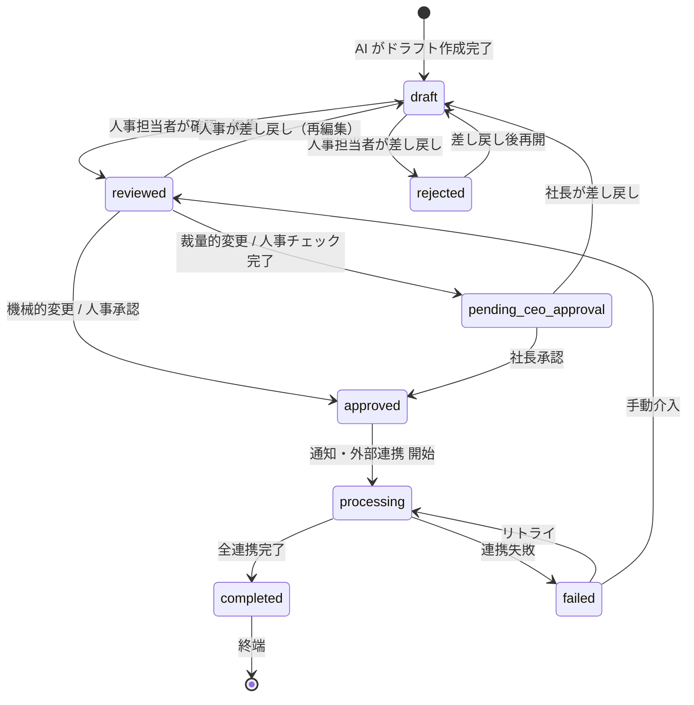

# SalaryDraft ステータス遷移図

ADR-006 および PRD §6.5 に基づく状態遷移の定義。

実装: `packages/shared/src/types.ts` の `VALID_TRANSITIONS`

## 遷移マップ

| From | To | 条件 |
|------|-----|------|
| `draft` | `reviewed` | 人事担当者が確認・編集完了 |
| `draft` | `rejected` | 人事担当者が差し戻し |
| `reviewed` | `approved` | **機械的変更**: 人事承認 |
| `reviewed` | `pending_ceo_approval` | **裁量的変更**: 人事チェック完了 |
| `reviewed` | `draft` | 人事担当者が再編集のため差し戻し |
| `pending_ceo_approval` | `approved` | 社長承認 |
| `pending_ceo_approval` | `draft` | 社長が差し戻し |
| `rejected` | `draft` | 差し戻し後に再開 |
| `approved` | `processing` | 通知・外部連携の開始 |
| `processing` | `completed` | 全連携完了（**終端**） |
| `processing` | `failed` | 連携失敗 |
| `failed` | `processing` | リトライ |
| `failed` | `reviewed` | 手動介入が必要な場合 |

## Mermaid 図

## 行き止まりチェック

- **終端ステータス**: `completed` のみ（意図的）
- **その他の全ステータス**: 1つ以上の遷移先あり ✅
- テスト: `packages/shared/src/__tests__/status-transitions.test.ts` で自動検証
