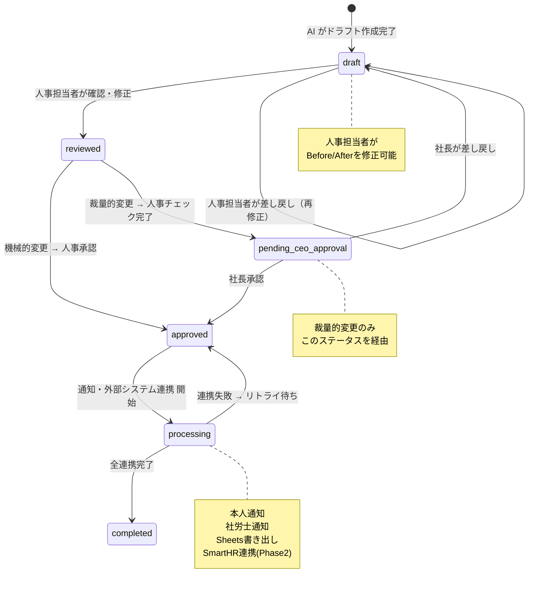

# システム要件書

**プロジェクト名**: HR-AI Agent
**バージョン**: 1.0.0
**作成日**: 2026-02-18
**ステータス**: Draft

---

## 目次

1. [概要](#1-概要)
2. [機能要件](#2-機能要件)
3. [非機能要件](#3-非機能要件)
4. [外部インターフェース仕様](#4-外部インターフェース仕様)
5. [データモデル概要](#5-データモデル概要)
6. [ステータス遷移図](#6-ステータス遷移図)
7. [フェーズ別スコープ表](#7-フェーズ別スコープ表)

---

## 1. 概要

### 1.1 システム目的

HR-AI Agent は、Google Chat 上での社長・管理職の指示を AI（Gemini）が解釈して人事変更ドラフトを自動生成し、人間の承認プロセスを経てステークホルダーへの通知とシステムデータ更新を自動化する人事業務支援システムである。

### 1.2 対象業務フロー

```
社長/管理職がGoogle Chatで指示
        ↓
AI（Gemini）がIntent分類・パラメータ抽出
        ↓
給与計算プログラムがドラフト作成（Before/After）
        ↓
人事担当者がWeb管理ダッシュボードで確認・修正
        ↓
承認ワークフロー（機械的変更: 人事承認 / 裁量的変更: 人事→社長承認）
        ↓
本人通知 + 社労士通知 + Google Sheets更新 + SmartHR連携
```

### 1.3 対象スコープ

| 項目 | 内容 |
|------|------|
| 対象組織 | 正社員、パート、登録訪問看護師 |
| 対象チャットスペース | 人事関連（全社共通）、有川チーム（PJT...） |
| スペースID | `AAAA-qf5jX0`（サービスアカウント参加済み） |
| Phase 1 処理対象 | 給与変更（全カテゴリの分類記録は実施） |
| Phase 2 処理対象 | 入社フロー、他カテゴリ自動化 |

### 1.4 用語定義

| 用語 | 定義 |
|------|------|
| ドラフト | AI が生成した人事変更案（Before/After 付き、未承認状態） |
| 機械的変更 | 規程に基づき一意に計算可能な変更（例: 資格取得→手当追加） |
| 裁量的変更 | 社長の裁量が入る変更（例:「30万くらいで」→複数案提示） |
| Intent | チャット発言から分類される業務カテゴリ（10種類） |
| Pitchテーブル | 給与等級・号俸に対応するマスターデータ |

---

## 2. 機能要件

### FR-1: チャットボット機能（Google Chat 連携）

| 項目 | 内容 |
|------|------|
| **ID** | FR-1 |
| **優先度** | Must |
| **対象 Phase** | Phase 1 |

#### 説明

Google Chat の指定スペースを監視し、メンションまたはキーワードを検知した際に起動する。LLM（Gemini）を用いてメッセージから Intent を分類し、処理に必要なパラメータを抽出する。

#### 機能詳細

- **起動条件**: サービスアカウントへのメンション、または指定キーワードの検知
- **Intent 分類（10カテゴリ）**:

| カテゴリ | サンプル件数 | Phase 1 自動処理 |
|----------|------------|----------------|
| 給与・社保 | 66件 | 対象 |
| 退職・休職 | 45件 | 分類記録のみ |
| 入社・採用 | 38件 | 分類記録のみ |
| その他 | 34件 | 分類記録のみ |
| 契約・条件変更 | 22件 | 分類記録のみ |
| 施設・異動 | 12件 | 分類記録のみ |
| 外国人・ビザ | 12件 | 分類記録のみ |
| 研修・監査 | 9件 | 分類記録のみ |
| 健康診断・面談 | 8件 | 分類記録のみ |
| 勤怠・休暇 | 5件 | 分類記録のみ |

- **パラメータ抽出**: 対象者名、変更内容、有効日、金額指示等
- **ACK 返信**: 処理受付完了をチャットスペースへ即時返信（3秒以内）
- **エラー通知**: Intent 不明または処理失敗時、チャット上で担当者へエスカレーション

#### 受入条件

- [ ] 指定スペースへのメンションで正しく起動すること
- [ ] 10カテゴリすべてに分類でき、DB へ記録されること
- [ ] Intent 分類精度: 既存サンプル 251 件に対して 85% 以上
- [ ] ACK レスポンスが 3 秒以内に返ること
- [ ] 分類不能メッセージが担当者にエスカレーションされること

---

### FR-2: 給与計算・ドラフト作成機能

| 項目 | 内容 |
|------|------|
| **ID** | FR-2 |
| **優先度** | Must |
| **対象 Phase** | Phase 1 |

#### 説明

LLM が抽出したパラメータをもとに、確定的プログラムコードで給与計算を行い、変更ドラフトを生成・DB 保存する。

#### 機能詳細

**マスターデータ参照:**

| マスターデータ | 用途 |
|--------------|------|
| Pitchテーブル | 等級・号俸と基本給のマッピング |
| 地域手当 | 勤務地別手当 |
| 資格手当 | 取得資格別手当 |
| 役職手当 | 役職別手当 |

**2パターンの変更処理:**

| 変更タイプ | 例 | 処理方法 |
|------------|-----|---------|
| 機械的な変更 | 資格取得→手当追加、昇格→Pitch変更 | 規程に基づく一意の計算 |
| 裁量的な変更 | 「30万くらいで」 | 複数組み合わせ提案（3案程度） |

**ドラフト内容:**

- Before: 現在の給与構成（全手当の内訳）
- After: 変更後の給与構成（変更箇所フラグ付き）
- 変更差分サマリー
- AI の判断理由メモ（抽出プロセス・適用規程の説明）
- 適用した変更タイプ（machine / discretionary）

#### 受入条件

- [ ] 機械的変更でマスターデータに基づく正確な金額が計算されること
- [ ] 裁量的変更で複数案（最低2案）が提示されること
- [ ] ドラフトに Before/After が含まれること
- [ ] AI の判断理由がメモとして保存されること
- [ ] 金銭計算が LLM 外の確定的コードで実行されること（テストによる検証）
- [ ] ドラフト作成が 30 秒以内に完了すること

---

### FR-3: Web 管理ダッシュボード

| 項目 | 内容 |
|------|------|
| **ID** | FR-3 |
| **優先度** | Must |
| **対象 Phase** | Phase 1 |

#### 説明

人事担当者・社長がドラフトの確認・修正・承認を行うための Web アプリケーション（Next.js）。

#### 機能詳細

**ドラフト一覧画面:**

- ステータスフィルタ（draft / reviewed / pending_ceo_approval / approved / completed）
- 対象者名・変更タイプ・作成日・担当者でのソート・絞り込み
- 変更タイプ（機械的 / 裁量的）の視覚的区別

**ドラフト詳細画面:**

- Before/After 差分表示（変更箇所ハイライト）
- AI の判断理由メモ表示
- 人事担当者による Before/After 値の修正機能
- 修正履歴の表示

**承認ワークフロー:**

| 変更タイプ | フロー |
|------------|--------|
| 機械的変更 | 人事ダブルチェック → `approved` |
| 裁量的変更 | 人事チェック → 社長承認 → `approved` |

- 承認・差し戻し・保留の操作
- 差し戻し時はコメント必須

**監査ログ画面:**

- 指示・解釈・修正・承認の全操作履歴表示
- 操作者・日時・変更内容の詳細表示

#### 受入条件

- [ ] 全ステータスでのフィルタリングが動作すること
- [ ] Before/After 差分が変更箇所ハイライト付きで表示されること
- [ ] 人事担当者が金額・手当の値を修正できること
- [ ] 機械的変更フローで人事承認後に `approved` へ遷移すること
- [ ] 裁量的変更フローで社長承認後に `approved` へ遷移すること
- [ ] 初期表示が 2 秒以内に完了すること
- [ ] 権限外ユーザーが承認操作を実行できないこと

---

### FR-4: 通知・連携機能

| 項目 | 内容 |
|------|------|
| **ID** | FR-4 |
| **優先度** | Must（①〜③）/ Should（④⑤） |
| **対象 Phase** | Phase 1（①〜③）/ Phase 2（④） |

#### 説明

承認完了後、関係するすべてのステークホルダーへ通知し、外部システムのデータを更新する。

#### 機能詳細

| # | 通知先 | 内容 | 手段 |
|---|--------|------|------|
| ① | 本人 | 辞令内容の通知 | Google Chat DM または Gmail（PDF 辞令添付） |
| ② | 社労士 | 変更内容の業務依頼 | 業務依頼 Spreadsheet への自動貼付 + スペースへの通知 |
| ③ | 職員給与一覧 Spreadsheet | 変更内容の反映 | Google Sheets API による書き出し |
| ④ | SmartHR | 従業員データ更新 | CSV 出力または SmartHR API（Phase 2） |
| ⑤ | 各種権限 | 必要に応じた権限変更 | 対象システムの API（Phase 2） |

**Google Sheets 書き出し対象:**

- 正社員給与履歴
- パート給与履歴
- 登録訪問看護師の給与履歴

#### 受入条件

- [ ] 本人への通知が承認後に自動送信されること
- [ ] 社労士向け Spreadsheet への自動記入が動作すること
- [ ] 社労士スペースへの通知が送信されること
- [ ] 正社員・パート・登録訪問看護師の全員に対して Sheets 書き出しが動作すること
- [ ] 通知失敗時に管理者へアラートが飛ぶこと

---

### FR-5: Intent 分類・記録機能

| 項目 | 内容 |
|------|------|
| **ID** | FR-5 |
| **優先度** | Must |
| **対象 Phase** | Phase 1 |

#### 説明

対象スペースの全チャットメッセージを 10 カテゴリに分類して記録する。Phase 1 では給与・社保カテゴリのみを自動処理し、その他は記録にとどめる。将来の自動化拡大に向けてデータを蓄積する。

#### 機能詳細

- 全受信メッセージに対する Intent 分類の実行
- 分類結果（カテゴリ・信頼スコア・抽出パラメータ）の DB 記録
- 分類不能（`unknown`）メッセージの記録と担当者エスカレーション
- Intent 別の処理振り分けルーティング

#### 受入条件

- [ ] 全メッセージが 10 カテゴリのいずれかに分類されること
- [ ] 分類結果が信頼スコアとともに DB へ保存されること
- [ ] 給与・社保カテゴリのみドラフト作成フローが起動すること
- [ ] その他カテゴリは分類記録のみで処理が終了すること

---

### FR-6: 監査ログ機能

| 項目 | 内容 |
|------|------|
| **ID** | FR-6 |
| **優先度** | Must |
| **対象 Phase** | Phase 1 |

#### 説明

人事データ変更に関わる全操作の完全な監査証跡を記録・保持する。

#### 記録対象

| イベント | 記録内容 |
|----------|---------|
| チャット受信 | スペース・送信者・原文・受信日時 |
| Intent 分類 | カテゴリ・信頼スコア・抽出パラメータ・LLM への入出力 |
| ドラフト作成 | 計算ロジック・使用マスターデータ・生成結果 |
| ドラフト修正 | 修正者・修正前後の値・修正日時・修正理由 |
| 承認操作 | 承認者・承認日時・操作結果（承認/差し戻し） |
| 通知送信 | 送信先・送信内容・送信日時・送信結果 |
| 外部システム連携 | 連携先・送信データ・レスポンス・実行日時 |

#### 受入条件

- [ ] 上記全イベントがログとして記録されること
- [ ] ログが変更・削除不可な形式で保存されること
- [ ] 監査ログが 7 年以上保持されること
- [ ] 特定のドラフトに紐づく全操作履歴が一覧表示できること

---

## 3. 非機能要件

### NFR-1: 正確性（Accuracy）

| 項目 | 内容 |
|------|------|
| **ID** | NFR-1 |
| **カテゴリ** | 正確性 |

#### 説明

給与計算の誤りは法的・経済的リスクを伴うため、計算は確定的プログラムコードで実行し、LLM の使用範囲をパラメータ抽出に限定する。

#### 測定基準

| 測定項目 | 基準値 |
|----------|--------|
| 機械的変更の計算誤り率 | 0%（ユニットテスト全パスが必須） |
| Intent 分類精度 | 既存サンプルに対して 85% 以上 |
| パラメータ抽出精度 | 給与関連パラメータで 90% 以上 |

#### 実装要件

- 給与計算ロジックは LLM 非依存の確定的関数として実装
- 計算関数はすべてユニットテスト対象（境界値・異常系含む）
- 最終的な数値確認は必ず人間が実施（承認ステップ必須）

---

### NFR-2: 監査性（Auditability）

| 項目 | 内容 |
|------|------|
| **ID** | NFR-2 |
| **カテゴリ** | 監査性 |

#### 説明

労働基準法・個人情報保護法の遵守のため、人事変更に関わる全操作の完全な追跡可能性を保証する。

#### 測定基準

| 測定項目 | 基準値 |
|----------|--------|
| ログ保持期間 | 最低 7 年（労基法準拠） |
| 給与変更履歴 | 永久保持 |
| ログカバレッジ | 全操作イベントの 100% 記録 |
| ログ改ざん検知 | 追記専用（INSERT のみ、UPDATE/DELETE 禁止） |

#### 対象範囲

- 正社員・パート・登録訪問看護師すべてを対象とする

---

### NFR-3: セキュリティ（Security）

| 項目 | 内容 |
|------|------|
| **ID** | NFR-3 |
| **カテゴリ** | セキュリティ |

#### 説明

給与情報は PII（個人識別情報）の最高機密に分類され、厳格なアクセス制御と通信暗号化を実施する。

#### 測定基準

| 測定項目 | 基準値 |
|----------|--------|
| 認証方式 | Google OAuth 2.0 必須 |
| DB 接続 | firebase-admin SDK (ADC) 経由のみ許可 |
| AI サービス通信 | VPC 内プライベートアクセス（Vertex AI） |
| RBAC ロール | 最低 3 ロール（社長・人事担当者・閲覧者） |

#### RBAC 権限設計

| ロール | 閲覧 | 修正 | 人事承認 | 社長承認 | ログ閲覧 |
|--------|------|------|---------|---------|---------|
| 社長 | 全員分 | 不可 | 不可 | 可 | 可 |
| 人事担当者 | 全員分 | 可 | 可 | 不可 | 可 |
| 閲覧者 | 担当分のみ | 不可 | 不可 | 不可 | 不可 |

---

### NFR-4: パフォーマンス（Performance）

| 項目 | 内容 |
|------|------|
| **ID** | NFR-4 |
| **カテゴリ** | パフォーマンス |

#### 測定基準

| 測定項目 | 基準値 | 計測方法 |
|----------|--------|---------|
| チャット ACK レスポンス | 3 秒以内 | Google Chat イベント受信から返信完了まで |
| ドラフト作成完了 | 30 秒以内 | 処理開始から DB 保存・チャット通知完了まで |
| Web 画面初期表示 | 2 秒以内 | Time to Interactive（TBT < 300ms） |

#### 実装方針

- チャット ACK は即時返信し、ドラフト作成は非同期処理（Pub/Sub）
- Web 画面は静的生成（SSG）またはサーバーサイドレンダリング（SSR）でキャッシュ活用

---

### NFR-5: 可用性（Availability）

| 項目 | 内容 |
|------|------|
| **ID** | NFR-5 |
| **カテゴリ** | 可用性 |

#### 測定基準

| 測定項目 | 基準値 |
|----------|--------|
| 営業時間内稼働率 | 99.5% 以上（平日 9:00〜18:00） |
| 計画外ダウンタイム | 月あたり 2 時間以内 |
| 障害検知時間 | Cloud Monitoring アラートで 5 分以内 |

#### 実装方針

- Cloud Run のオートスケーリングによる負荷対応
- Firestore のマネージド HA（自動フェイルオーバー不要・マルチリージョンレプリケーション）
- Cloud Monitoring + アラートポリシーによる障害監視

---

### NFR-6: データ保持（Data Retention）

| 項目 | 内容 |
|------|------|
| **ID** | NFR-6 |
| **カテゴリ** | データ保持 |

#### 測定基準

| データ種別 | 保持期間 | 根拠 |
|------------|---------|------|
| 監査ログ | 最低 7 年 | 労働基準法第 109 条 |
| 給与変更履歴 | 永久 | 業務要件 |
| チャットメッセージ原文 | 最低 7 年 | 監査要件 |
| 承認操作ログ | 最低 7 年 | 監査要件 |

#### 実装方針

- Firestore の自動バックアップ・ポイントインタイムリカバリ（PITR）有効化
- 長期保存データは Cloud Storage Coldline へのアーカイブ

---

## 4. 外部インターフェース仕様

### 4.1 Google Chat API

| 項目 | 内容 |
|------|------|
| 認証 | Service Account（JSON キー） |
| イベント受信 | Pub/Sub サブスクリプション経由 |
| メッセージ送信 | `spaces.messages.create` |
| 対象スペース ID | `AAAA-qf5jX0` |

**受信イベント形式（主要フィールド）:**

```json
{
  "type": "MESSAGE",
  "message": {
    "name": "spaces/{space}/messages/{message}",
    "sender": { "name": "users/{userId}", "displayName": "..." },
    "text": "Aさんの給与を来月から30万くらいにしてください",
    "createTime": "2026-02-18T09:00:00Z"
  },
  "space": { "name": "spaces/AAAA-qf5jX0" }
}
```

**送信メッセージ形式:**

```json
{
  "text": "承りました。給与変更のドラフトを作成します（処理ID: draft-123）"
}
```

---

### 4.2 SmartHR API（Phase 2）

| 項目 | 内容 |
|------|------|
| 認証 | OAuth 2.0 Bearer Token |
| 連携方式 | Phase 1: CSV 出力、Phase 2: REST API |
| 主要エンドポイント | `PUT /v1/employees/{id}` |
| 対象データ | 給与情報、雇用区分、役職 |

**CSV 出力フォーマット（Phase 1）:**

```csv
employee_id,last_name,first_name,base_salary,allowance_total,effective_date,change_reason
E001,山田,太郎,280000,50000,2026-03-01,給与改定
```

---

### 4.3 Google Sheets API

| 項目 | 内容 |
|------|------|
| 認証 | Service Account（スプレッドシートへの編集権限付与） |
| 操作 | `spreadsheets.values.append`（履歴追記） |
| 対象シート | 職員給与一覧（正社員・パート・登録訪問看護師各タブ） |

**書き出しデータ形式（列定義）:**

| 列 | 内容 |
|----|------|
| A | 変更日 |
| B | 従業員 ID |
| C | 氏名 |
| D | 変更前基本給 |
| E | 変更後基本給 |
| F | 変更前手当合計 |
| G | 変更後手当合計 |
| H | 変更理由 |
| I | 承認者 |
| J | 処理 ID（ドラフト ID） |

---

### 4.4 Gmail API

| 項目 | 内容 |
|------|------|
| 認証 | Service Account（Domain-Wide Delegation） |
| 操作 | `users.messages.send` |
| 送信元 | hr-system@[組織ドメイン] |
| 対象 | 本人への辞令通知（PDF 添付） |

**送信条件:** Google Chat DM が不可能な場合（アカウント未登録等）のフォールバック

---

## 5. データモデル概要

### 5.1 主要エンティティ一覧

```
Employee          - 従業員マスター
SalaryDraft       - 給与変更ドラフト（メインエンティティ）
SalaryDraftItem   - ドラフト明細（手当項目ごとの Before/After）
ApprovalLog       - 承認・操作ログ
ChatMessage       - 受信チャットメッセージ
IntentRecord      - Intent 分類結果
MasterData        - 給与マスター（Pitch/手当）
AuditLog          - 監査ログ（全操作の不変記録）
```

### 5.2 エンティティ詳細

#### Employee（従業員マスター）

| カラム名 | 型 | 説明 |
|----------|-----|------|
| `id` | UUID | PK |
| `employee_code` | VARCHAR | 従業員番号（ユニーク） |
| `full_name` | VARCHAR | 氏名 |
| `employment_type` | ENUM | `full_time` / `part_time` / `registered_nurse` |
| `department` | VARCHAR | 部署 |
| `position` | VARCHAR | 役職 |
| `base_salary` | INTEGER | 現在の基本給（円） |
| `google_chat_user_id` | VARCHAR | Google Chat ユーザー ID（通知用） |
| `email` | VARCHAR | メールアドレス（Gmail 通知フォールバック） |
| `created_at` | TIMESTAMP | 登録日時 |
| `updated_at` | TIMESTAMP | 最終更新日時 |

#### SalaryDraft（給与変更ドラフト）

| カラム名 | 型 | 説明 |
|----------|-----|------|
| `id` | UUID | PK |
| `chat_message_id` | UUID | FK → ChatMessage |
| `employee_id` | UUID | FK → Employee |
| `change_type` | ENUM | `machine` / `discretionary` |
| `status` | ENUM | ステータス（遷移図参照） |
| `before_base_salary` | INTEGER | 変更前基本給 |
| `after_base_salary` | INTEGER | 変更後基本給 |
| `before_total` | INTEGER | 変更前合計支給額 |
| `after_total` | INTEGER | 変更後合計支給額 |
| `effective_date` | DATE | 適用開始日 |
| `ai_reasoning` | TEXT | AI の判断理由メモ |
| `applied_rules` | JSONB | 適用した規程・マスターデータの参照情報 |
| `reviewed_by` | UUID | FK → User（人事担当者） |
| `approved_by` | UUID | FK → User（社長） |
| `created_at` | TIMESTAMP | 作成日時 |
| `updated_at` | TIMESTAMP | 最終更新日時 |

#### SalaryDraftItem（ドラフト明細）

| カラム名 | 型 | 説明 |
|----------|-----|------|
| `id` | UUID | PK |
| `draft_id` | UUID | FK → SalaryDraft |
| `item_type` | VARCHAR | 手当種別（例: `qualification_allowance`） |
| `item_name` | VARCHAR | 手当名（例: 「看護師資格手当」） |
| `before_amount` | INTEGER | 変更前金額 |
| `after_amount` | INTEGER | 変更後金額 |
| `is_changed` | BOOLEAN | 変更有無フラグ |

#### ChatMessage（受信チャットメッセージ）

| カラム名 | 型 | 説明 |
|----------|-----|------|
| `id` | UUID | PK |
| `space_id` | VARCHAR | Google Chat スペース ID |
| `google_message_id` | VARCHAR | Google Chat メッセージ ID（ユニーク） |
| `sender_google_id` | VARCHAR | 送信者 Google ユーザー ID |
| `sender_display_name` | VARCHAR | 送信者表示名 |
| `raw_text` | TEXT | メッセージ原文 |
| `received_at` | TIMESTAMP | 受信日時 |

#### IntentRecord（Intent 分類結果）

| カラム名 | 型 | 説明 |
|----------|-----|------|
| `id` | UUID | PK |
| `chat_message_id` | UUID | FK → ChatMessage |
| `intent_category` | ENUM | 10カテゴリのいずれか |
| `confidence_score` | FLOAT | 分類信頼スコア（0.0〜1.0） |
| `extracted_params` | JSONB | 抽出パラメータ（JSON） |
| `llm_input` | TEXT | LLM への入力プロンプト |
| `llm_output` | TEXT | LLM からの出力（生） |
| `created_at` | TIMESTAMP | 分類日時 |

#### MasterData（給与マスター）

| カラム名 | 型 | 説明 |
|----------|-----|------|
| `id` | UUID | PK |
| `master_type` | ENUM | `pitch` / `regional` / `qualification` / `position` |
| `code` | VARCHAR | マスターコード |
| `name` | VARCHAR | 名称 |
| `amount` | INTEGER | 金額（円） |
| `valid_from` | DATE | 適用開始日 |
| `valid_to` | DATE | 適用終了日（NULL = 現在有効） |

#### ApprovalLog（承認・操作ログ）

| カラム名 | 型 | 説明 |
|----------|-----|------|
| `id` | UUID | PK |
| `draft_id` | UUID | FK → SalaryDraft |
| `action` | ENUM | `reviewed` / `approved` / `rejected` / `modified` |
| `actor_id` | UUID | FK → User |
| `before_status` | ENUM | 操作前ステータス |
| `after_status` | ENUM | 操作後ステータス |
| `comment` | TEXT | コメント（差し戻し時必須） |
| `modified_fields` | JSONB | 修正フィールドの Before/After（修正時のみ） |
| `created_at` | TIMESTAMP | 操作日時 |

---

## 6. ステータス遷移図



### ステータス定義

| ステータス | 説明 | 操作可能者 |
|------------|------|-----------|
| `draft` | AI 生成直後、未レビュー | 人事担当者 |
| `reviewed` | 人事担当者確認済み | 人事担当者（機械的）、社長（裁量的） |
| `pending_ceo_approval` | 社長承認待ち（裁量的変更のみ） | 社長 |
| `approved` | 全承認完了、実行待ち | システム |
| `processing` | 通知・連携実行中 | システム |
| `completed` | 全処理完了 | - |

**差し戻しルール:**

- いずれのステータスからも `draft` に差し戻し可能
- 差し戻し時はコメント（理由）の記入が必須

---

## 7. フェーズ別スコープ表

### Phase 1（MVP）

**目標**: 給与変更業務のドラフト作成・承認・Sheets 連携の自動化

| 機能 | 要件 ID | 実装内容 |
|------|---------|---------|
| チャットボット起動 | FR-1 | スペース監視・メンション検知・ACK 返信 |
| Intent 分類（全カテゴリ） | FR-1, FR-5 | 10カテゴリ分類・DB 記録 |
| 給与計算・ドラフト作成 | FR-2 | 機械的・裁量的変更の両パターン |
| Web 管理ダッシュボード | FR-3 | ドラフト一覧・詳細・修正・承認 |
| 本人通知 | FR-4-① | Google Chat DM / Gmail フォールバック |
| 社労士通知 | FR-4-② | Spreadsheet 貼付 + スペース通知 |
| Sheets 書き出し | FR-4-③ | 全雇用区分の給与履歴更新 |
| 監査ログ | FR-6 | 全操作の完全記録 |
| セキュリティ基盤 | NFR-3 | Google OAuth / RBAC / Firestore ADC |

**Phase 1 対象外（分類記録のみ）:**

| カテゴリ | 対応 |
|----------|------|
| 退職・休職 | Intent 記録のみ |
| 入社・採用 | Intent 記録のみ |
| 契約・条件変更 | Intent 記録のみ |
| 施設・異動 | Intent 記録のみ |
| 外国人・ビザ | Intent 記録のみ |
| 研修・監査 | Intent 記録のみ |
| 健康診断・面談 | Intent 記録のみ |
| 勤怠・休暇 | Intent 記録のみ |

---

### Phase 2

**目標**: 自動化カテゴリの拡大と外部システム統合の深化

| 機能 | 要件 ID | 実装内容 |
|------|---------|---------|
| 入社フロー自動化 | FR-4-④ | 入社・採用カテゴリの自動処理 |
| SmartHR API 連携 | FR-4-④ | CSV 出力から REST API 連携へ移行 |
| PDF 辞令生成 | FR-4-① | PDF 自動生成・Gmail 添付送信 |
| 権限変更自動化 | FR-4-⑤ | 役職変更連動の権限変更 |
| 他カテゴリ自動化 | FR-5 | 退職・休職・契約変更等の処理追加 |

---

## 改訂履歴

| バージョン | 日付 | 変更内容 | 作成者 |
|------------|------|---------|--------|
| 1.0.0 | 2026-02-18 | 初版作成 | - |
